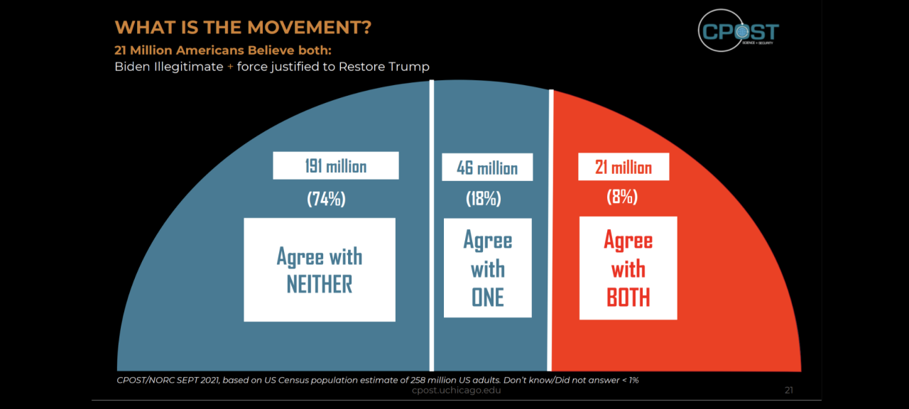
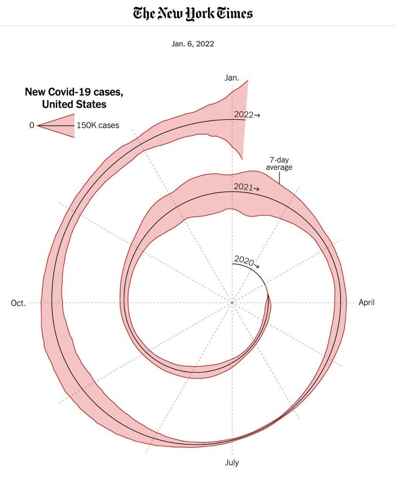
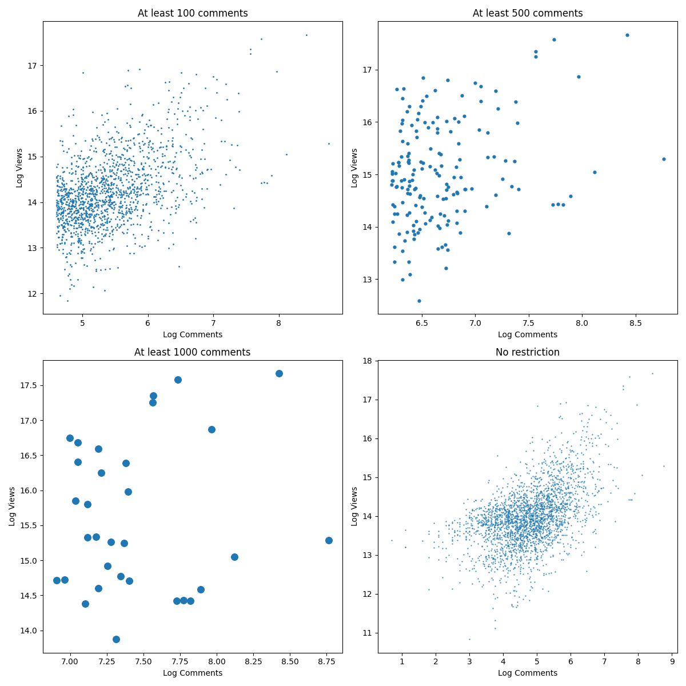
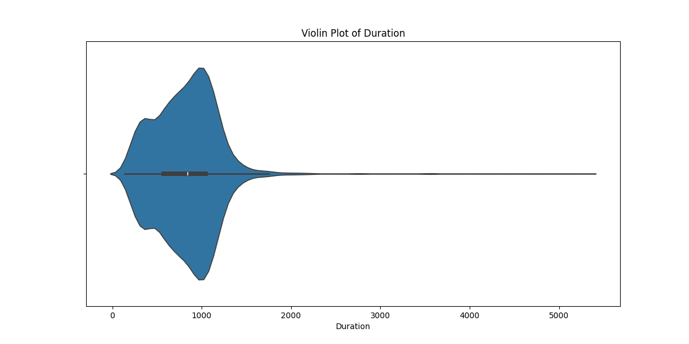
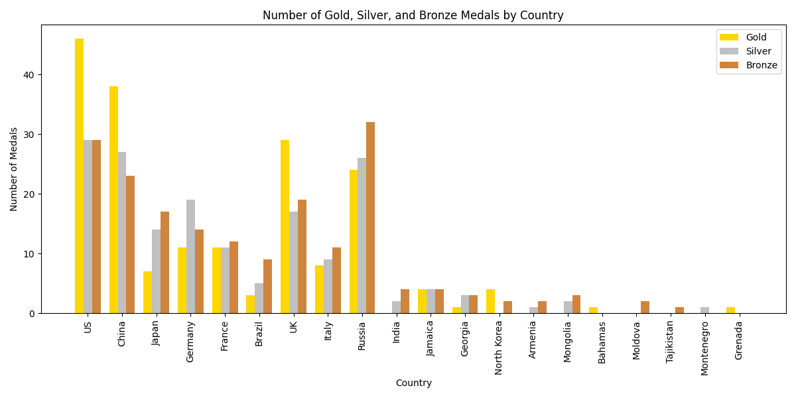

## Question 01

> Visit http://www.wtfviz.net. Find two visualizations to critique. Provide the visualizations you selected and your comments on them. You need to make use of the jargon employed in class and in Chapter 6 of the textbook in your discussions. Your comments on each visualization should answer the following questions:
>
> - What data is represented in this visualization? Be specific.
> - What questions does the visualization answer?
> - Describe one aspect of the visualization that is effective.
> - Describe one aspect of the visualization that is not effective.
> - Why do you like/dislike the visualization?
>

---

### Figure 1



#### What data is represented in this visualization? Be specific.

The visualization displays survey data on American adults' beliefs regarding two statements: the legitimacy of President Biden's election and the justification of using force to restore former President Trump. Specifically, it shows the distribution of responses on whether respondents agree that "Biden is illegitimate" and that "force is justified to restore Trump." Using a population estimate of 258 million adult Americans, the data is scaled up to represent the estimated number of people holding each belief, divided into three categories:

- 191 million (74%) who agree with neither statement.
- 46 million (18%) who agree with one of the statements.
- 21 million (8%) who agree with both statements.

These proportions are represented by three segments of a (semicircular) pie chart, with the "Agree with BOTH" group colored orange, "Agree with ONE" group in blue, and "Agree with NEITHER" group in blue.

#### What questions does the visualization answer?

This visualization answers questions such as:

- What percentage of Americans believe both that Biden is illegitimate and that force is justified to restore Trump?
- How many people agree with neither, one, or both statements?
- What proportion of the American adult population holds each specific belief, according to the survey data?
- Generally, what is the breakdown of political affiliation proportions as it relates to the president.

#### Describe one aspect of the visualization that is effective.

The intent to use a pie chart is effective in theory, as pie charts are useful for illustrating relative proportions within a single population. In cases where respondents fall into distinct, exclusive categories, a pie or semicircle chart can help viewers quickly compare the relative proportion/percentages of each group.

#### Describe one aspect of the visualization that is not effective.

The visualization distorts the relative proportions of each group, particularly the segment representing the 8% who "Agree with BOTH." This segment occupies approximately 35% of the semicircle, creating a lie factor of about 4.375, which makes this group appear much larger than it actually is. Such distortion misleads viewers and compromises the integrity of the data representation.

#### Why do you like/dislike the visualization?

While the visualization's extrapolation of data to a national scale is useful, its design choices detract from clarity and accuracy. In addition to the disproportionate sizing, other elements such as color-coding and redundant design features add confusion. For example:

- The color scheme groups "Agree with ONE" and "Agree with NEITHER" into similar shades, incorrectly implying these groups are more related to each other than to "Agree with BOTH."
- White text boxes are unnecessary and could be simplified with contrasting text colors.
- The semicircle format can imply half of a whole, potentially misleading viewers, while a stacked bar chart could represent overlapping beliefs more accurately.

Overall, these issues make the visualization misleading and visually cluttered. A more effective alternative would avoid these pitfalls, presenting the data with clearer proportions and a simpler design.


### Figure 2



#### What data is represented in this visualization? Be specific.

This visualization represents the daily count of new COVID-19 cases in the United States from early 2020 through January 2022, plotted with a 7-day moving average to smooth out day-to-day fluctuations. The data is displayed in a spiral format, where each full rotation represents one calendar year. The visualization intends to showcase seasonal trends in COVID-19 cases, highlighting the timing and scale of surges over multiple years.

#### What questions does the visualization answer?

This visualization provides insights into questions such as:

- How did the pattern of COVID-19 cases change over time, from 2020 to early 2022?
- Are there noticeable seasonal spikes or fluctuations in COVID-19 cases across years?
- How do surges in one year compare in magnitude and timing to those in previous years?

#### Describe one aspect of the visualization that is effective.

The visualization achieves a relatively high data-ink ratio, effectively minimizing clutter and extraneous elements. By focusing on the essential data, it avoids unnecessary embellishments and concisely conveys key information about the response variable's scale and time progression. The axis is clearly labeled with case counts and uses a simple spiral to illustrate the 7-day moving average, allowing viewers to quickly understand that the data points represent averaged values over time.

#### Describe one aspect of the visualization that is not effective.

The spiral format is misleading because it implies that the radial layout or outward distance has a meaningful interpretation, which is not the case here. As the spiral progresses outward, each rotation covers a greater distance, visually exaggerating later fluctuations in case counts. This distortion introduces a "lie factor" by making it appear as though the rate of change has increased dramatically over time. In reality, COVID-19 case trends were relatively steady from 2020 through most of 2021, with significant fluctuations only appearing later. The outermost sections, where recent data is located, occupy around 80% of the spiral, creating a misleading lie factor of about  $\frac{0.8}/{0.5} = 1.6$ compared to the more stable inner periods, thus overstating the variation in recent data.

#### Why do you like/dislike the visualization?

While visually distinct, this visualization suffers from design issues that detract from its accuracy:


- **Misleading radial scaling**: The outward expansion distorts the rate of change, making fluctuations seem more significant in later years, which misrepresents the data.
- **Unnecessary decorative choices**: Although the chart achieves a good data-ink ratio, elements like the red border, grid lines, and shaded areas add minor chartjunk. These could be simplified to focus purely on the spiral itself, aligning better with Tufte’s principle of maximizing data clarity.
- **Complex layout**: The split center axis and outward orientation add complexity without adding insight, and a linear or stacked line chart could more accurately convey the data without distortion. The is an example of chart junk: where the design elements do not add value to the data representation and overshadow the data itself.

In summary, while the high data-ink ratio and clean design are positives, the spiral format ultimately misrepresents the rate and magnitude of COVID-19 case changes over time, making this visualization visually interesting but misleading.


## Question 02

> We will make use of the `ted_main` data set for this problem. Use `matplotlib` to construct scatter plots for four sets of data points, where each data point consists of log transformed value of the *comments* ($x$-coordinate) and log transformed value of the *views* ($y$-coordinate) fields. 
> 
> The difference in the sets of data points is the filtering; one is filtered with respect to talks with at least $100$ comments, one with at least $500$ comments, one with at least $1000$ comments and one with no restriction at all (all the rows of the data frame). 
> 
> Experiment with the point size parameter of the scatter plot function to find the most revealing value for each data set.
>

---




It appears that the key consideration when selecting an appropriate point size for a scatter plot is to adjust the size inversely with data density. For high-density data sets, larger point sizes lead to overplotting, making the scatter plot cluttered and difficult to interpret, and potentially indicating the need for alternative plot types or data sampling. Conversely, for sparse data sets, smaller point sizes may obscure trends, even when increased significantly, as the relationship between variables may not be clearly visualized with a scatter plot alone.


```python
import matplotlib.pyplot as plt
import pandas as pd
import numpy as np

dataset_url = "https://raw.githubusercontent.com/cpethe/TED_Talks/master/ted_main.csv"
ted_main = pd.read_csv(dataset_url)

# Filtered data points with copies
four_sets_of_data_points = [
    ted_main[ted_main['comments'] >= 100].copy(),
    ted_main[ted_main['comments'] >= 500].copy(),
    ted_main[ted_main['comments'] >= 1000].copy(),
    ted_main.copy()
]

# Log-transformed values
for data_points in four_sets_of_data_points:
    data_points['log_comments'] = np.log(data_points['comments'])
    data_points['log_views'] = np.log(data_points['views'])

# Scatter plot
fig, axs = plt.subplots(2, 2, figsize=(12, 12))

# [(row, column, min_comments, max_comments, title, scatter_size)]
subplot_properties = [
    # With so many data points, we need to reduce the size significantly
    (1, 1, 0, 0, 'No restriction', .3),
    # With so few data points, we should make use of the available space to emphasize the data
    (1, 0, 1000, 0, 'At least 1000 comments', 70), 
    # Scale down the scatter size to about the same change in data point magnitude
    (0, 1, 500, 1000, 'At least 500 comments', 12),
    (0, 0, 100, 500, 'At least 100 comments', 1),
]

for row, column, min_comments, max_comments, title, scatter_size in subplot_properties:
    data_points = four_sets_of_data_points[row * 2 + column]
    axs[row, column].scatter(data_points['log_comments'], data_points['log_views'], s=scatter_size)
    axs[row, column].set_title(title)
    axs[row, column].set_xlabel('Log Comments')
    axs[row, column].set_ylabel('Log Views')

plt.tight_layout()
plt.show()
```


## Question 03

> In this problem you will use `matplotlib` to experiment with different color scales to construct scatter plots for a particular set of $(x, y, z)$ points, where color is used to represent the $z$ dimension. 
> 
> Use the log transformed values of the `comments`, the `views` fields, and the `duration` fields of the `ted_main` dataset as the $x$-, $y$-, $z$-coordinates respectively, where a filtering is applied to work on the data points with at least $750$ comments. 
> 
> Which color schemes work best? Which are the worst? Explain why.
>

---


The color maps that involve multiple colors are confusing as it's hard to intuitively understand what the scale is supposed to be. However, the color maps that use a gradient with a single color are much easier to understand. If the $z$-axis could be split into discrete categories more easily, it might make more sense to use one of the colormaps that involved multiple colors. For this case, it seems `Blues` is the best choice.


```python
import matplotlib.pyplot as plt
import pandas as pd
import numpy as np

dataset_url = "https://raw.githubusercontent.com/cpethe/TED_Talks/master/ted_main.csv"
ted_main = pd.read_csv(dataset_url)

# Filtered data points with copies
data_points = ted_main[ted_main['comments'] >= 750].copy()

# Log-transformed values
data_points['log_comments'] = np.log(data_points['comments'])
data_points['log_views'] = np.log(data_points['views'])
data_points['log_duration'] = np.log(data_points['duration'])

# Scatter plot
plt.figure(figsize=(12, 6))
scatter = plt.scatter(
    data_points['log_comments'], 
    data_points['log_views'], 
    c=data_points['log_duration'], 
    cmap='Blues', # Colormaps: viridis, plasma, inferno, magma
    s=50,
    alpha=0.6
)
plt.colorbar(scatter, label='Log Duration')
plt.xlabel('Log Comments')
plt.ylabel('Log Views') 
plt.title('Scatter Plot of Log Comments vs. Log Views with Log Duration')

plt.show()
```

## Question 04

> Create a violin plot of the `duration` field using the `seaborn` library. Comment on the information provided by the visualization including the major changes in the distribution of the values, median value, where the middle $50\%$ of the values are located, and at what value do we start seeing the outliers.
>

---




Based on the information provided by the violin plot of the `duration` field:

- The distribution of the `duration` values is skewed to the right, with a long tail of higher values. This indicates that the majority of TED Talk durations are relatively short, with a few talks having significantly longer durations.
- The median value is about 850 seconds, which is depicted by the white bar in the whisker plot contained within the violin plot.
- The middle $50\%$ of the values are located between approximately 580 and 1050 seconds, as indicated by both the width of the violin plot and the interquartile range (IQR) represented by the width of the whisker plot inside the violin.
- In a whisker plot, the outliers typically are values outside of the whisker (the thin lines extending from the violin plot). In this case, it seems the lower bound is about 100 seconds, and the upper bound is around 1500 seconds, beyond which we start seeing outliers. These outliers are represented by the points outside the whisker lines, indicating that they are significantly higher or lower than the majority of the data points.


```python
import seaborn as sns
import pandas as pd

dataset_url = "https://raw.githubusercontent.com/cpethe/TED_Talks/master/ted_main.csv"
ted_main = pd.read_csv(dataset_url)

plt.figure(figsize=(12, 6))
sns.violinplot(x=ted_main['duration'])
plt.title('Violin Plot of Duration')
plt.xlabel('Duration')
plt.show()
```


## Question 05

> Download the *2012 London Summer Olympics Data* from [here](https://www.data-manual.com/data). Create a 2D heatmap visualization of the data using the seaborn library. More specifically one axes of the 2D heat map should consist of the rows (`countries`) of the data set, whereas the other axes consists of the columns (`GDP`, `population` etc.) of the dataset. 
> 
> You may want to apply some type of normalization such as z-score normalization on the columns of the dataset to get the same color gradient scale for different columns
>

---


```python
import seaborn as sns
import pandas as pd
import numpy as np
import matplotlib.pyplot as plt

# Load the data
olympics_data = pd.read_csv("https://www.data-manual.com/datafiles/olympics.csv")

# Set the correct column for country names
country_column = 'Country name'

# Copy data, set 'Country name' column as the index, and drop 'ISO country code' column
normalized_olympics_data = olympics_data.copy()
normalized_olympics_data.set_index(country_column, inplace=True)
normalized_olympics_data.drop(columns=['ISO country code'], inplace=True)

# Apply z-score normalization only to numeric columns
for column in normalized_olympics_data.select_dtypes(include=['number']).columns:
    normalized_olympics_data[column] = (normalized_olympics_data[column] - normalized_olympics_data[column].mean()) / normalized_olympics_data[column].std()

# Create a 2D heatmap visualization
plt.figure(figsize=(12, 6))
sns.heatmap(normalized_olympics_data, cmap='coolwarm', annot=True, fmt=".2f")
plt.title('2D Heatmap of 2012 London Summer Olympics Data')
plt.show()
```


## Question 06

> Using the `matplotlib` library create a grouped bar chart for the olympics data where each country is shown at the $x$-axis with the names of the countries as the labels and each country has a group of three bars depicting its number of gold, silver, and bronze medals. 
> 
> Check [here](https://matplotlib.org/stable/gallery/lines_bars_and_markers/barchart.html#sphx-glr-gallery-lines-bars-and-markers-barchart-py) for an example of grouped bar charts.
>

---





```python
import matplotlib.pyplot as plt
import pandas as pd

# Load the data
olympics_data = pd.read_csv("https://www.data-manual.com/datafiles/olympics.csv")

# Set the correct column for country names
country_column = 'Country name'

# Copy data, set 'Country name' column as the index, and drop 'ISO country code' column
grouped_olympics_data = olympics_data.copy()
grouped_olympics_data.set_index(country_column, inplace=True)
grouped_olympics_data.drop(columns=['ISO country code'], inplace=True)

# Create a grouped bar chart
plt.figure(figsize=(12, 6))
x = range(len(grouped_olympics_data))

# Define the width of each bar
bar_width = 0.25

# Plot the bars for gold, silver, and bronze medals
plt.bar(x, grouped_olympics_data['Gold'], width=bar_width, label='Gold', color='gold')
plt.bar([i + bar_width for i in x], grouped_olympics_data['Silver'], width=bar_width, label='Silver', color='silver')
plt.bar([i + 2 * bar_width for i in x], grouped_olympics_data['Bronze'], width=bar_width, label='Bronze', color='peru')

# Set the x-axis labels to the country names
plt.xticks([i + bar_width for i in x], grouped_olympics_data.index, rotation=90)

# Add labels and title
plt.xlabel('Country')
plt.ylabel('Number of Medals')
plt.title('Number of Gold, Silver, and Bronze Medals by Country')
plt.legend()

plt.tight_layout()
plt.show()
```


## Question 07

> Suppose you build a classifier that answers yes on every possible input. 
> 
> What precision and recall will this classifier achieve?
>

---


We consider a binary classifier that answers "yes" on every possible input.

If $p$ is the true population proportion of positive elements, then there are $p \times n$ actual positives and $(1 - p) \times n$ actual negatives.

Under the model, there will correctly be $p \times n$ true positives. The remainder will also be predicted as positive, yielding $(1 - p) \times n$ false positives. Since the classifier always predicts positive, there will be no true negatives or false negatives.

### Precision

The formula for precision is:

$$
\text{Precision} = \frac{\text{TP}}{\text{TP} + \text{FP}}
$$

Substituting the values we have:

$$
\text{Precision} = \frac{p \times n}{p \times n + (1 - p) \times n}
$$

Simplifying:

$$
\text{Precision} = \frac{p}{p + (1 - p)}
$$

$$
\text{Precision} = \frac{p}{1}
$$

$$
\text{Precision} = p
$$

Thus, the classifier will achieve a precision equal to the true population proportion of positive elements, $p$.


### Recall

The formula for recall is:

$$
\text{Recall} = \frac{\text{TP}}{\text{TP} + \text{FN}}
$$

Substituting the values we have:

$$
\text{Recall} = \frac{p \times n}{p \times n + 0}
$$

Simplifying:

$$
\text{Recall} = \frac{p \times n}{p \times n}
$$

$$
\text{Recall} = 1
$$

Thus, the classifier will achieve a recall of $1$, indicating that it correctly identifies all actual positive elements.


## Question 08

> Suppose $f ≤ 1/2$ is the fraction of positive elements in a classification. 
> 
> What is the probability $p$ that the blind classifier should guess positive, as a function of $f$, in order to maximize the specific evaluation metric below? 
> 
> Report both $p$ and the expected evaluation score the blind classifier achieves
>
> 1. Accuracy
> 1. Precision
> 1. Recall
> 1. F-score
>

---

We consider a blind classifier that has $p$ probability of guessing positive.

If $f$ is the true population proportion of positive elements, then there are $f \times n$ true positives and $(1 - f) \times n$ true negatives.

Under the model, $p$ proprtion of those true positives are correctly classified as positive, yielding $p \times f \times n$ true positives. The remaining $(1 - p) \times f \times n$ true positives are incorrectly classified as negative, yielding $(1 - p) \times f \times n$ false negatives.

Similarly, $(1 - p) \times (1 - f) \times n$ true negatives are correctly classified as negative, yielding $(1 - p) \times (1 - f) \times n$ true negatives. The remaining $p \times (1 - f) \times n$ true negatives are incorrectly classified as positive, yielding $p \times (1 - f) \times n$ false positives.

### Accuracy

The formula for accuracy is:

$$
\text{Accuracy} = \frac{\text{TP} + \text{TN}}{\text{TP} + \text{TN} + \text{FP} + \text{FN}}
$$

We can attempt to simplify the problem by setting the denominator to $n$, since the number of true positives, true negatives, false positives, and false negatives should sum to $n$.

$$
\text{Accuracy} = \frac{\text{TP} + \text{TN}}{n}
$$

Substituting the values we have:

$$
\text{Accuracy} = \frac{p \times f \times n + (1 - p) \times (1 - f) \times n}{n}
$$

Simplifying:

$$
\text{Accuracy} = p \times f + (1 - p) \times (1 - f)
$$


Thus, the expected evaluation score the blind classifier achieves is:

$$
\text{Accuracy} = p \times f + (1 - p) \times (1 - f)
$$

To find the optimal value of $p$ that maximizes accuracy for $f < 1/2$, we can simply consider that the classifier should always guess negative since the fraction of positive elements is less than $1/2$. Therefore, the optimal value of $p$ is $0$

For the optimal value of $p = 0$, the expected evaluation score the blind classifier achieves is:

$$
\text{Accuracy} = 1 - f
$$

### Precision

The formula for precision is:

$$
\text{Precision} = \frac{\text{TP}}{\text{TP} + \text{FP}}
$$

Substituting the values we have:

$$
\text{Precision} = \frac{p \times f \times n}{p \times f \times n + p \times (1 - f) \times n}
$$

Simplifying:

$$
\text{Precision} = \frac{f}{f + (1 - f)}
$$

Thus, the expected evaluation score the blind classifier achieves is:

$$
\text{Precision} = f
$$

Since the accuracy is not dependent on $p$, any value of $p$ will yield the same precision, and they can all be considered equally optimal.


### Recall

The formula for recall is:

$$
\text{Recall} = \frac{\text{TP}}{\text{TP} + \text{FN}}
$$

Substituting the values we have:

$$
\text{Recall} = \frac{p \times f \times n}{p \times f \times n + (1 - p) \times f \times n}
$$

Simplifying:


$$
\text{Recall} = \frac{f}{f + (1 - p) \times f} = p
$$

Thus, the expected evaluation score the blind classifier achieves is:

$$
\text{Recall} = p
$$

To find the optimal value of $p$ that maximizes recall for $f < 1/2$, we can simply consider that the classifier should always guess positive since the fraction of positive elements is less than $1/2$. Therefore, the optimal value of $p$ is $1$

For the optimal value of $p = 1$, the expected evaluation score the blind classifier achieves is:

$$
\text{Recall} = 1
$$

### F-score

The formula for F-score is:

$$
\text{F-score} = \frac{2 \times \text{Precision} \times \text{Recall}}{\text{Precision} + \text{Recall}}
$$

Substituting the values we have:

$$
\text{F-score} = \frac{2 \times f \times p}{f + p}
$$

Thus, the expected evaluation score the blind classifier achieves is:

$$
\text{F-score} = \frac{2 \times f \times p}{f + p}
$$

To find the optimal value of $p$ that maximizes F-score for $f < 1/2$, we can consider that the classifier should always guess positive since the fraction of positive elements is less than $1/2$. Therefore, the optimal value of $p$ is $1$


## Question 09

> Suppose we want to train a binary classifier where one class is very rare. 
> 
> Give an example of such a problem. 
> 
> How should we train this model? 
> 
> What metrics should we use to measure performance?
>

---


Consider a problem where we want to detect fraudulent transactions in a credit card dataset. In this scenario, fraudulent transactions are rare compared to legitimate transactions, making it a class imbalance problem. The vast majority of transactions are legitimate, while only a small fraction are fraudulent.

In this particular case, we must consider the practical implications of misclassifying fraudulent transactions. False negatives (failing to detect fraudulent transactions) can lead to financial losses for the credit card company and its customers. On the other hand, false positives (incorrectly flagging legitimate transactions as fraudulent) can inconvenience customers and damage the company's reputation. Given these considerations, we should prioritize minimizing false negatives.

To do so, we should train the model with a focus on recall, which measures the proportion of actual positive cases that the model correctly identifies. A high recall value indicates that the model is effective at detecting fraudulent transactions, reducing the number of false negatives. In this context, we are more concerned with capturing all fraudulent transactions (even if it means more false positives) than with minimizing false positives at the expense of missing fraudulent transactions.

In addition to recall, we should also consider other metrics such as precision, F1-score, and the area under the ROC curve (AUC-ROC). Precision measures the proportion of correctly identified positive cases among all cases identified as positive, providing insight into the model's accuracy in flagging fraudulent transactions. The F1-score combines precision and recall into a single metric, balancing the trade-off between false positives and false negatives. The AUC-ROC evaluates the model's performance across various thresholds, providing a comprehensive assessment of its ability to distinguish between positive and negative cases.

By focusing on recall and considering other relevant metrics, we can train the model to effectively detect fraudulent transactions while minimizing the risk of financial losses and customer inconvenience.


## Question 10

> What is cross-validation? How might we pick the right value of $k$ for $k$-fold cross validation?


----


*UPDATE: This question is ommited from the assignment*

