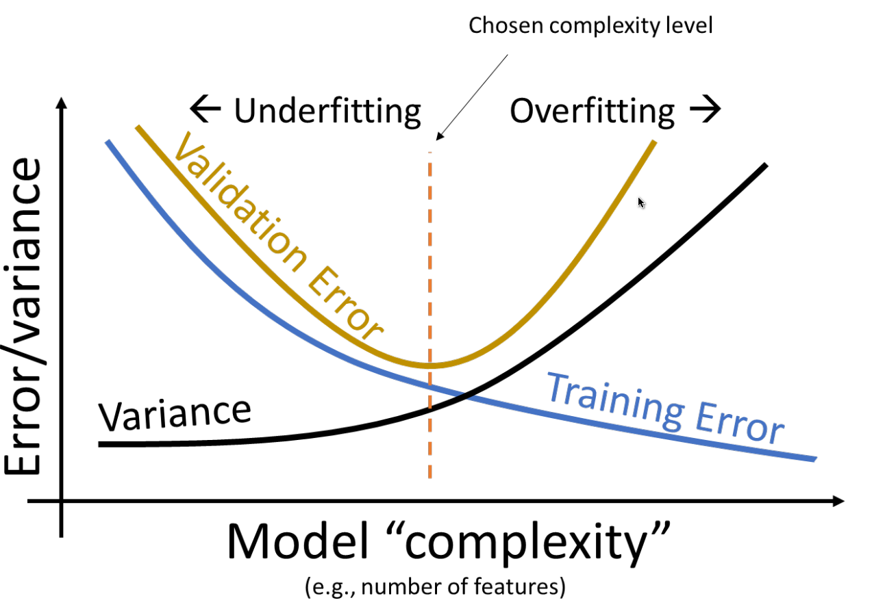

## Regularization

- Scale data after train/test split before regularization
  - Z-score standardization
    - $z = \frac{x - \mu}{\sigma}$
    - $\mu$ is mean, $\sigma$ is standard deviation
  - Otherwise, different scales of features inappropriately scale features
- Remove outliers if you believe they reflect noise rather than signal, since RSS is sensitive to outliers
- Lasso (L1)
  - Least absolute shrinkage and selection operator
  - Minimze RSS with constraint: $\lambda \sum_{j=1}^p |\beta_j| \leq t$
    - $\lambda$ is regularization penality
  - Keep coefficients small $\rightarrow$ some coefficients become 0
- Ridge (L2)
  - Minimize RSS with constraint: $\lambda \sum_{j=1}^p \beta_j^2 \leq t$
    - Equivalent to $\sum_{i=1}^n (y_i - \beta_0 - \sum_{j=1}^p \beta_j x_{ij})^2 + \lambda \sum_{j=1}^p \beta_j^2$
  - Keep coefficients small $\rightarrow$ all coefficients are non-zero
- Heteroskedasticity
  - SE, CI, etc. rely on constant variance of error terms
  - Sometimes variance of error terms is not constant
  - Solution: transform data to stabilize variance
    - E.g., transform response with log or square root

## Multicollinearity

- Hypothesis tests for $\beta_j$ are unreliable when predictors are correlated, different results based on which specific linear combination used in the model
