# Probability

## Sampling without Replacement

- **Sampling without replacement** is a method of sampling from a population in which each member of the population can be sampled only once.
- **Example**: Suppose we have a population of 5 people: A, B, C, D, and E. If we sample 2 people without replacement, there are 10 possible samples: AB, AC, AD, AE, BC, BD, BE, CD, CE, and DE.
- **Formula**: The number of ways to sample `k` items from a population of `n` items without replacement is given by the binomial coefficient:
  - $$
    \binom{n}{k} = \frac{n!}{k!(n-k)!}
    $$  


### Example - Student Council

> A President (P) and a treasurer (T) chosen from 20 people including Alice, Bob. Probability that Alice is president and Bob is treasurer?


- **Solution**: 
  - Total number of ways to choose P and T from 20 people = $\binom{20}{2}$
  - Number of ways to choose Alice as P and Bob as T = 1
  - Probability = $\frac{1}{\binom{20}{2}}$ = $\frac{1}{380}$


### Example - Birthdays

> Probability that 2 people in a group of 20 have the same birthday?


The size of the sample space is $365^{20} \implies$ $|\Omega| = 365^{20}$


#### Using the Complement

Consider the complement: probability that no 2 people have the same birthday:

$1 - P(\text{no 2 people have the same birthday}) = 1 - \frac{365}{365} \times \frac{364}{365} \times \ldots \times \frac{346}{365} =$

$1 - \frac{\binom{365}{20}}{365^{20}} =$

$1 - \frac{365!}{345! \times 365^{20}}$


## Conditional Probability

### Probability in Light of New Information


> Ignoring prior probabilities is a mistake

> Also a mistake to ignore new information and not update prior probabilities

### Formulas

$P(A|B) = \frac{P(A \cap B)}{P(B)}$

> "Probability of A given B" = "Probability of A and B" / "Probability of B"

Divide by B because B is the new sample space -- the denominator is the new sample space (since we are given that B has occurred).

The numerator is the intersection of A and B because we are looking for the probability of A given that B has occurred.

$P(A \cap B) = P(A|B) \times P(B)$

> "Probability of A and B" = "Probability of A given B" * "Probability of B"

#### Example - Dice

> Two dice are rolled. What is the probability that the sum of the dice is 7 or 11 given that at least one of the two dice is even?

$A$: Sum of dice is 7 or 11

$B$: At least one die is even

The $P(B|A)$ is the probability that at least one die is even given that the sum is 7 or 11. Since 7 and 11 are odd, it is necessary that one of the dice is even so $P(B|A) = 1$.

$P(A|B) = \frac{P(A \cap B)}{P(B)} =$

The number of outcomes that satisfy both A and B is the number of outcomes whose sum is 7 or 11 and at least one die is even. There are 8 such outcomes: (1, 6), (2, 5), (3, 4), (4, 3), (5, 2), (6, 1), (5, 6), and (6, 5).


2 dice rolled repeatedly, sum T observed for each roll.

Probability that T = 5 observed before T = 6?

$P(T = 5) = \frac{4}{36}$

$P(T = 6) = \frac{5}{36}$

$P(T = 5 | T = 6 \lor T = 5) = \frac{\frac{4}{36}}{\frac{5}{36}} = \frac{4}{9}$

Since observing T = 5 before T = 6 is the same as observing T = 5 before T = 6 or T = 5, the probability is the same as the probability of observing T = 5.


#### Example - Balls

>  2 balls drawn, without replacement, from box with  red and 
 blue balls. Probability that 1st ball red and 2nd ball blue?

$P(R_1 \cap B_2) = P(R_1) \times P(B_2 | R_1)$


$P(B_2 | R_1) = \frac{n_{B}}{n-1}$

$P(R_1) = \frac{n_{R}}{n}$

$P(R_1 \cap B_2) = \frac{n_{R}}{n} \times \frac{n_{B}}{n-1}$

### Multiple Variables

$P(A \cap B \cap C) = P(A) \times P(B|A) \times P(C|A \cap B)$

> "Probability of A and B and C" = "Probability of A" * "Probability of B given A" * "Probability of C given A and B"

### Law of Total Probability

$P(A) = P(A \cap B) + P(A \cap B^c)$

For any event A, the probability of A $= \sum_{i=1}^{n} P(B_i) \times P(A|B_i)$

#### Example - Balls

Someone selects a box, selects a ball from it (both random). We ar etold it is red. PRobability that Box 1 was selected.

$P(B_1 | R) = \frac{P(R | B_1) \times P(B_1)}{P(R)}$

The Probability of red is found using the law of total probability:

$P(R) = P(R | B_1) \times P(B_1) + P(R | B_2) \times P(B_2)$

> "Probability of red" = "Probability of red given Box 1" * "Probability of Box 1" + "Probability of red given Box 2" * "Probability of Box 2"

The Probability of red given Box 1 is number of red balls in Box 1 divided by total number of balls in Box 1 times the probability of selecting Box 1.

$P(R | B_1) = \frac{\text{Number of red balls in Box 1}}{\text{Total number of balls in Box 1}} \times P(B_1)$

The probability of selecting Box 1 is the probability of selecting Box 1 given that there are 2 boxes.

$P(B_1) = \frac{1}{2}$


### Bayes' Theorem

$$
P(B_i|A) = \frac{P(A|B_i) \times P(B_i)}{P(A)} = 
$$

$$
\frac{P(A \cap B_i)}{P(A)}
$$

With Law of Total Probability:

$$
P(B_i|A) = \frac{P(A|B_i) \times P(B_i)}{\sum_{j=1}^{k} P(A|B_j) \times P(B_j)}
$$

Where: 

-  $B_i, B_j, \ldots$ partition the sample space $\Omega$
-  $A$ is an event in the sample space $\Omega$

### Summary

***Conditional Probability***

$$
P(A|B) = \frac{P(A \cap B)}{P(B)}
$$

$$
P(A \cap B | C) = P(A | C) \times P(B | A \cap C)
$$

***Multiplication Rule***

$$
P(A \cap B) = P(A|B) \times P(B) = P(B|A) \times P(A)
$$

***Law of Total Probability***

$$
P(A) = \sum_{i=1}^{n} P(B_i) \times P(A|B_i)
$$

***Bayes' Theorem***

$$
P(B_i|A) = \frac{P(A|B_i) \times P(B_i)}{P(A)} = \frac{P(A \cap B_i)}{P(A)} = \frac{P(A|B_i) \times P(B_i)}{\sum_{j=1}^{k} P(A|B_j) \times P(B_j)}
$$

-----------------------------------------------

## Independent Events


Definition: Two events $A$ and $B$ are independent if the occurrence of one does not affect the occurrence of the other. $P(A | B) = P(A)$

Using Bayes' Theorem:

$$
P(A|B) = \frac{P(A \cap B)}{P(B)} = P(A) \implies
$$

$$
P(A \cap B) = P(A) \times P(B)
$$


**Example - Values of $p$, $q$, and $r$ s.t. $A$ and $B$ are independent**

- P(first coin heads) = $r$
- If first coin heads, P(second coin heads) = $p$
- If first coin tails, P(second coin heads) = $q$

> What are the values of $p$, $q$, and $r$ such that $A$ and $B$ are independent?


If $A$ and $B$ are independent, then $P(A \cap B) = P(A) \times P(B)$:

$$
P(A) = \frac{P(A \cap B)}{P(B)}
$$

$$
P(A) = \frac{r * p}{r * p + (1 - r)  * q} = r \implies
$$

$$
r^2 * p + r * (1 - r) * q = rp \implies
$$

$$
rp + q - qr = p \implies
$$

$$
p - rp = q - qr \implies
$$

$$
p = q
$$

### Indepdence of Several Events

$A_1, A_2, \ldots, A_n$ are independent if for every subset of these events, the probability of the intersection of the events in the subset is the product of the probabilities of the events in the subset.

$$
P(A_1 \cap A_2 \cap \ldots \cap A_n) = P(A_1) \times P(A_2) \times \ldots \times P(A_n)
$$

**Example - Cumulative Independent Events (Dice)**

4 dice are rolled. House wins if at least one die is a 6, otherwise player wins. Probability that house wins?


$P(\text{House wins}) = 1 - P(\text{Player wins})$

$P(\text{Player wins}) = P(\text{No 6})^4$

$P(\text{House wins}) = 1 - P(\text{No 6})^4$

$P(\text{No 6}) = \frac{5}{6}$

$P(\text{House wins}) = 1 - \left(\frac{5}{6}\right)^4$

### Disjoint Events vs. Independent Events

if $A$ and $B$ are disjoint $\implies$ $A$ and $B$ are dependent (*almost always*)

*Knowing $B$ occurred changes $P(A)$ to $0$ (unless it is already $0$)*

<!-- If $A$ and $B$ are not disjoint, they must be independent for $P(A \cap B) = P(A) \times P(B)$ to hold. $A \cap B \neq \emptyset \implies$ $A$ and $B$ are independent. -->

## Random Variables


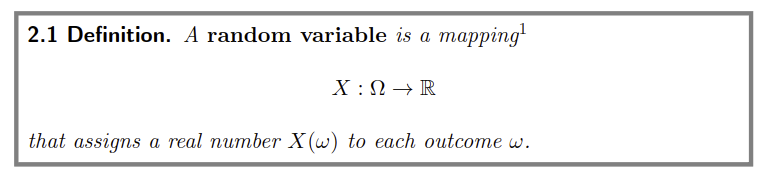

A random variable is a variable whose value is subject to variations due to randomness.

> A real-valued function defined on $\Omega$ is a *random variable*.

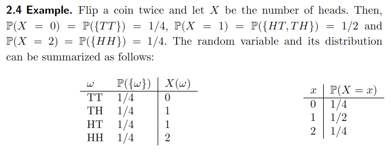


### Discrete Random Variables and Discrete Distributions

A random variable is discrete if it can take on a countable number of values (including countably infinite).


#### Probability Mass Function (PMF)

The probability mass function (PMF) of a discrete random variable $X$ is a function that gives the probability that $X$ is exactly equal to some value.

$$
P(X = x) = p(x), \quad \forall x \in \mathbb{R}
$$

$\{x : p(x) > 0\}$ is the support of the PMF; is the support of $X$.


The probability mass function is related to the cumulative distribution function (CDF) by:

$$
F(x) = P(X \leq x) = \sum_{t \leq x} p(t)
$$

*That is, the CDF is the sum of the PMF up to $x$.*


##### Properties

- $0 \leq p(x) \leq 1$
- $\sum_{x} p(x) = 1$
- For an interval $P(x_2 \leq X \leq x_4) = \sum_{x \in \{x_2, x_3, x_4\}} p(x)$

```python
import numpy as np
import pandas as pd
import matplotlib.pyplot as plt

N = 100_000

dice1 = np.random.randint(1, 7, size=N)
dice2 = np.random.randint(1, 7, size=N)

dicepairs = [(dice1[i], dice2[i]) for i in range(N)]

# Plot the dice pairs
df = pd.DataFrame(dicepairs, columns=["dice1", "dice2"])
df["sum"] = df["dice1"] + df["dice2"]
df["sum"].hist(bins=11, range=(1.5, 12.5), density=True, rwidth=0.8)
plt.xlabel("Sum of dice")
plt.ylabel("Probability")
plt.title("Sum of two dice")
plt.show()
```

**Example - Dice**

> $X$: num of heads when a fair coin is tossed 10 times

$\Omega = \{(H, H, H, H, H, H, H, H, H, H), (H, H, H, H, H, H, H, H, H, T), \ldots\}$

*Combination Formula*:

$$
\binom{n}{k} = \frac{n!}{k!(n-k)!}
$$

$P(X = x) = \binom{10}{x} \times \left(\frac{1}{2}\right)^{10}$

> The denominator is the sample space -- the number of ways to choose 10 coin flips.
>
> The numerator is the number of ways to choose $x$ heads from 10 coin flips.


**Example - Boys and Girls**

> Class with $B$ boys and $G$ girls
>
> $n$ selected rnadomly without replacment. 
>
> $X$: number of boys in the selection

Denominator:

$\Omega = \binom{B+G}{n} =$ the number of ways to choose $n$ students from $B+G$ students


Numerator:

$P(X = x) = \binom{B}{x} \times \binom{G}{n-x}  =$ the number of ways to choose $x$

#### Point Mass Distributions

A point mass distribution is a distribution in which all the probability mass is concentrated at a single point.

$$
P(X = x) = 1
$$

Where:

- $x$ is a particular value
- $P(X = x)$ is the probability of observing $x$
- $P(X = x) = 1$ for a point mass distribution
- $P(X = x) = 0$ for all other values of $x$
- The support of the PMF is $\{x\}$

#### Discrete Uniform Distribution

A discrete uniform distribution is a distribution in which all outcomes are equally likely.

$$
P(X = x) = \frac{1}{n}
$$

Where:

- $n$ is the number of possible outcomes
- $x$ is a particular outcome
- $P(X = x)$ is the probability of observing $x$

#### Bernoulli Distribution

A Bernoulli distribution is a distribution in which there are only two possible outcomes: success and failure.

$$
P(X = x) = p^x \times (1-p)^{1-x}
$$

Where:

- $x$ is the number of successes
- $p$ is the probability of success
- $1-p$ is the probability of failure
- $p^x$ is the probability of observing $x$ successes
- $(1-p)^{1-x}$ is the probability of observing $1-x$ failures
- $x \in \{0, 1\}$

#### Binomial Distribution

A binomial distribution is a distribution in which there are only two possible outcomes: success and failure.

For a binomial distribution, the PMF is given by:

$$
P(X = x) = \binom{n}{x} \times p^x \times (1-p)^{n-x}
$$

Where:

- $n$ is the number of trials 
- $x$ is the number of successes
- $p$ is the probability of success
- $1-p$ is the probability of failure

A random variable is called a *Binomial random variable* if it follows a binomial distribution.

- $X$ is a random variable
- $x$ denotes a particular value of $X$
- $n$ and $p$ are parameters of the distribution (fixed real numbers)
  - $p$ is usually unknown and is estimated from data 

#### Geometric Distribution

A geometric distribution is a distribution in which the number of trials until the first success is observed.

$$
P(X = k) = (1-p)^{k-1} \times p, k \geq 1
$$

Where:

- $k$ is the number of trials until the first success
- $p$ is the probability of success
- $1-p$ is the probability of failure
- $(1-p)^{k-1}$ is the probability of observing $k-1$ failures followed by a success

#### Poisson Distribution

A Poisson distribution is a distribution in which the number of events in a fixed interval of time or space is modeled.

$$
P(X = k) = \frac{\lambda^k}{k!} \times e^{-\lambda}
$$

Where:

- $k$ is the number of events
- $\lambda$ is the average number of events in the interval
- $e$ is Euler's number
- $k!$ is the factorial of $k$
- $e^{-\lambda}$ is the probability of observing no events in the interval
- $\lambda^k / k!$ is the probability of observing $k$ events in the interval


### Continuous Random Variables and Continuous Distributions

A random variable is continuous if it can take on an uncountable number of values.

#### Cumulative Distribution Function (CDF)

The cumulative distribution function (CDF) of a random variable $X$ is a function that gives the probability that $X$ will take on a value less than or equal to $x$.

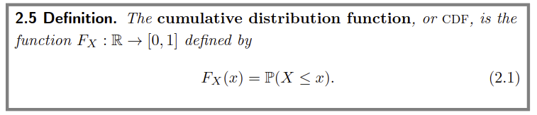

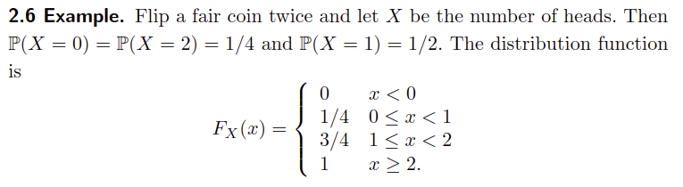

> CDF completely describes the distribution of a random variable


> A function $F$ mapping the real line to $[0, 1]$ is a CDF for some probability $P$ iff $F$ satisfies the following properties:
>
> 1. $F$ is non-decreasing: $x_1 \leq x_2 \implies F(x_1) \leq F(x_2)$
> 2. $F$ is normalized:
>     $\lim_{x \to -\infty} F(x) = 0$
>     $\lim_{x \to \infty} F(x) = 1$
> 3. $F$ is right-continuous: $\lim_{x \to x_0^+} F(x) = F(x_0)$


#### Probability Density Function (PDF)

The probability density function (PDF) of a continuous random variable $X$ is a function that gives the probability that $X$ will take on a value in a given interval.

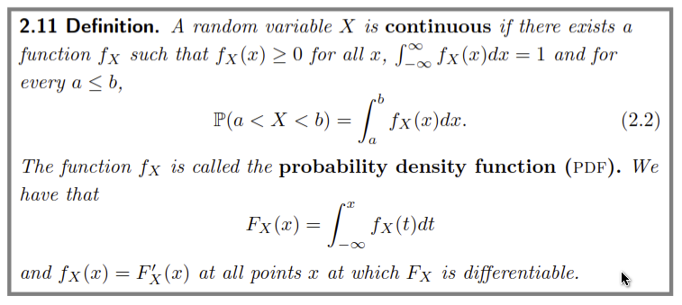

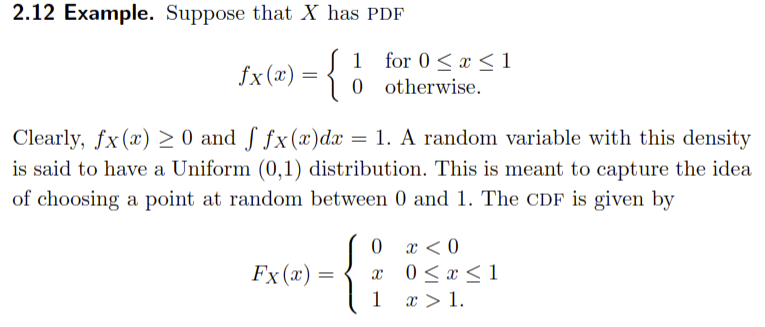

PDF is the derivative of the CDF:

$$
f(x) = \frac{dF(x)}{dx}
$$

Thus, the CDF is the integral of the PDF:

$$
F(x) = \int_{-\infty}^{x} f(t) dt
$$

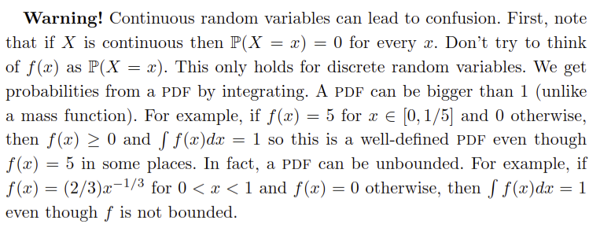


#### Inverse CDF (Quantile Function)

The inverse of the CDF is the quantile function, which gives the value of $x$ for a given probability $p$.

$$
F^{-1}(p) = x
$$

$$
F^{-1}(q) = \inf\{x : F(x) \geq q\}
$$

*That is, the quantile function gives the value of $x$ for which the CDF is equal to $q$.*

##### Quartiles

1. First quartile: $F^{-1}(0.25)$
2. Second quartile: $F^{-1}(0.5)$
3. Third quartile: $F^{-1}(0.75)$
4. Fourth quartile: $F^{-1}(1)$


#### Uniform Distribution

A uniform distribution is a distribution in which all outcomes are equally likely.

$$
f(x) = \begin{cases}
\frac{1}{b-a} & \text{if } a \leq x \leq b \\
0 & \text{otherwise}
\end{cases}
$$

Where:

- $a$ is the lower bound
- $b$ is the upper bound
- $f(x)$ is the probability density function
- $f(x) = 1 / (b-a)$ for $a \leq x \leq b$
- $f(x) = 0$ otherwise
- $f(x) \geq 0$ for all $x$

The distribution function is given by:

$$
F(x) = \begin{cases}
0 & \text{if } x < a \\
\frac{x-a}{b-a} & \text{if } a \leq x \leq b \\
1 & \text{if } x > b
\end{cases}
$$

The probability that $X$ is in the interval $[c, d]$ is given by:

$$
P(c \leq X \leq d) = \int_{c}^{d} f(x) dx = \frac{d-c}{b-a}
$$

The *integral* of density function (for some interval) is some probability -- the density function itself does not give probabilities (for continuous random variables).

**Example - Dart in Circle**

> A dart is thrown at a circular target. The probability that the dart lands in a particular region is proportional to the area of the region. The dart is equally likely to land anywhere in the region.

The `cdf` is the area of the region up to a point $x$.

For a given length $x$, the cdf is the area of the region up to $x$ divided by the total area of the region:

$$
F(x) = \frac{\pi x^2}{\pi 1^2} = x^2
$$

Thus,

$$
F(x) = \begin{cases}
0 & \text{if } x < 0 \\
x^2 & \text{if } 0 \leq x \leq 1 \\
1 & \text{if } x > 1
\end{cases}
$$

*The probability of $x \geq 1$ is 1 because the dart is guaranteed to land in the region.*


#### Normal (Gaussian) Distribution

A normal distribution is a distribution in which the data is symmetric and bell-shaped.

$$
f(x) = \frac{1}{\sqrt{2\pi\sigma^2}} \times e^{-\frac{(x-\mu)^2}{2\sigma^2}}
$$

Where:

- $\mu$ is the mean
- $\sigma$ is the standard deviation
- $e$ is Euler's number
- $\pi$ is a mathematical constant
- $f(x)$ is the probability density function
- $f(x) \geq 0$ for all $x$
- $f(x)$ is symmetric about the mean
- $f(x)$ is bell-shaped
- $f(x)$ is unimodal
- $f(x)$ is continuous


##### Standard Normal Distribution

A standard normal distribution is a normal distribution with a mean of 0 and a standard deviation of 1.

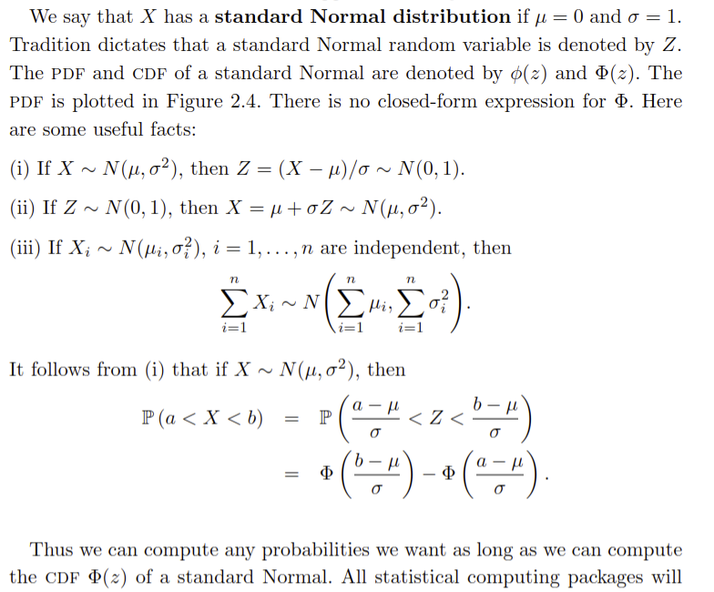


Suppose that $X ~ N(3, 5)$. Find $P(X > 1)$.

$$
P(X > 1) = 1 - P(X \leq 1) =
$$

$$
1 - P\left(Z \leq \frac{1-3}{\sqrt(5)}\right) =
$$

$$
1 - P(Z \leq -0.8944) =
$$

$$
1 - \Phi(-0.8944) = 0.81
$$

#### Exponential Distribution

An exponential distribution is a distribution in which the time between events is modeled.

$$
f(x) = \lambda e^{-\lambda x}
$$

Where:

- $\lambda$ is the rate parameter
- $e$ is Euler's number
- $f(x)$ is the probability density function
- $f(x) \geq 0$ for all $x$
- $f(x)$ is continuous
- $f(x)$ is unimodal


#### Gamma Distribution

A gamma distribution is a distribution in which the time until $k$ events is modeled.

$$
f(x) = \frac{\lambda^k}{\Gamma(k)} \times x^{k-1} \times e^{-\lambda x}
$$

Where:

- $\lambda$ is the rate parameter
- $k$ is the shape parameter
- $\Gamma(k)$ is the gamma function
- $e$ is Euler's number
- $f(x)$ is the probability density function
- $f(x) \geq 0$ for all $x$
- $f(x)$ is continuous

#### Beta Distribution

A beta distribution is a distribution in which the probability of success is modeled.

$$
f(x) = \frac{x^{\alpha-1} \times (1-x)^{\beta-1}}{B(\alpha, \beta)}
$$

Where:

- $\alpha$ is the shape parameter
- $\beta$ is the shape parameter
- $B(\alpha, \beta)$ is the beta function
- $f(x)$ is the probability density function
- $f(x) \geq 0$ for all $x$
- $f(x)$ is continuous
- $f(x)$ is unimodal


#### Cauchy Distribution

A Cauchy distribution is a distribution in which the data is symmetric and heavy-tailed.

$$
f(x) = \frac{1}{\pi(1+x^2)}
$$

Where:

- $\pi$ is a mathematical constant
- $f(x)$ is the probability density function
- $f(x) \geq 0$ for all $x$
- $f(x)$ is symmetric about the mean
- $f(x)$ is heavy-tailed

#### t-Distribution

A t-distribution is a distribution in which the data is symmetric and bell-shaped.

$$
f(x) = \frac{\Gamma\left(\frac{\nu+1}{2}\right)}{\sqrt{\nu\pi} \times \Gamma\left(\frac{\nu}{2}\right)} \times \left(1 + \frac{x^2}{\nu}\right)^{-\frac{\nu+1}{2}}
$$

Where:

- $\nu$ is the degrees of freedom
- $\Gamma$ is the gamma function
- $f(x)$ is the probability density function
- $f(x) \geq 0$ for all $x$
- $f(x)$ is symmetric about the mean
- $f(x)$ is bell-shaped
- $f(x)$ is unimodal
- $f(x)$ is continuous


#### Chi-Squared Distribution

A chi-squared distribution is a distribution in which the sum of squared standard normal random variables is modeled.

$$
f(x) = \frac{x^{\frac{k}{2}-1} \times e^{-\frac{x}{2}}}{2^{\frac{k}{2}} \times \Gamma\left(\frac{k}{2}\right)}
$$

Where:

- $k$ is the degrees of freedom
- $\Gamma$ is the gamma function
- $f(x)$ is the probability density function
- $f(x) \geq 0$ for all $x$
- $f(x)$ is continuous
- $f(x)$ is unimodal
- $f(x)$ is right-skewed
- $f(x)$ is non-negative


#### F-Distribution

An F-distribution is a distribution in which the ratio of two chi-squared random variables is modeled.

$$
f(x) = \frac{\sqrt{\frac{(n_1 \times x)^{n_1} \times n_2^{n_2}}{(n_1 \times x + n_2)^{n_1 + n_2}}}}{x \times B\left(\frac{n_1}{2}, \frac{n_2}{2}\right)}
$$

Where:

- $n_1$ is the degrees of freedom
- $n_2$ is the degrees of freedom
- $B$ is the beta function
- $f(x)$ is the probability density function
- $f(x) \geq 0$ for all $x$
- $f(x)$ is continuous
- $f(x)$ is unimodal
- $f(x)$ is right-skewed

### Bivariate Distributions

A bivariate distribution is a distribution in which two random variables are modeled.

#### Continuous Bivariate Distributions

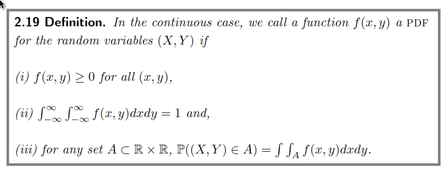

#### Discrete Bivariate Distributions

In the discrete case, the joint probability mass function (PMF) is given by:

$$
P(X = x, Y = y) = p(x, y)
$$

Where:

- $X$ and $Y$ are random variables
- $x$ and $y$ are particular values of $X$ and $Y$
- $p(x, y)$ is the joint probability mass function
- $p(x, y) \geq 0$ for all $x$ and $y$


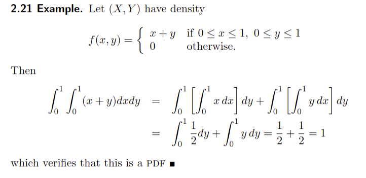


#### Marginal Distributions

##### Discrete

The marginal distribution of a bivariate distribution is the distribution of one of the random variables.


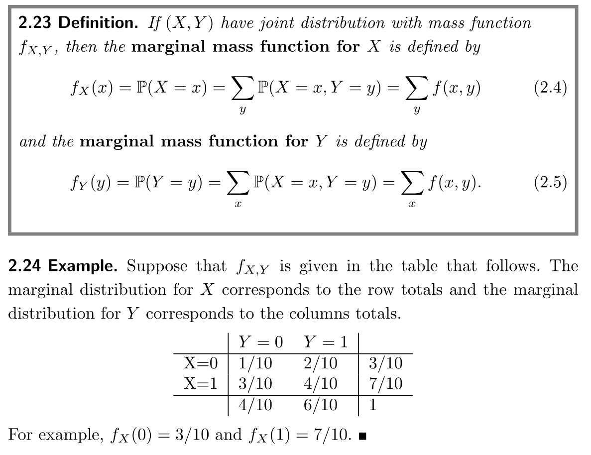

##### Continuous

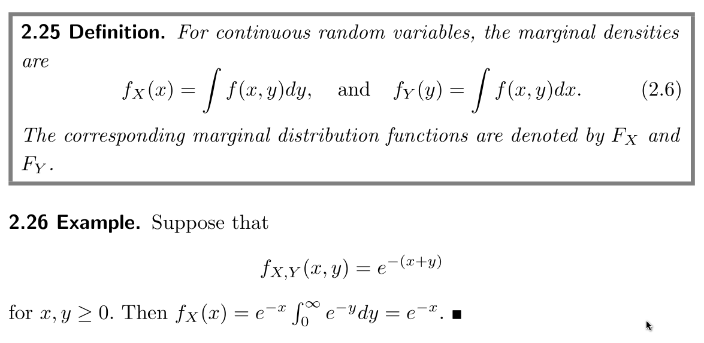


Suppose that

$$
f(x, y) = \begin{cases}
x + y & \text{if } 0 \leq x \leq 1, 0 \leq y \leq 1 \\
0 & \text{otherwise}
\end{cases}
$$

To find the marginal distribution of $Y$, we are looking to find the area under the curve of $f(x, y)$ with respect to $x$. That is, for a given point y, sum the values of $f(x, y)$ for all $x$. This represents summing the probability at each point $x$ -- which represents the probability of $Y = y$ at that point.

The range for which the probability is non-zero is $0 \leq y \leq 1$. Thus, we should integrate $f(x, y)$ with respect to $x$ over the range $0 \leq x \leq 1$:

$$
f_Y(y) = \int_{0}^{1} f(x, y) dx = \int_{0}^{1} x + y dx = \left[\frac{x^2}{2} + xy\right]_{0}^{1} = \frac{1}{2} + y
$$

The interpretation of this answer is that the probability of $Y = y$ is $\frac{1}{2} + y$ for $0 \leq y \leq 1$. I.e., the probability of $Y = y$ is found by summing the probabilities that $X = x$ and $Y = y$ across all valid values of $x$.

## Independent Random Variables

Two random variables $X$ and $Y$ are independent if the occurrence of one does not affect the occurrence of the other.

$$
P(X \in A, Y \in B) = P(X \in A) \times P(Y \in B)
$$

Where:

- $X \in A$ is the event that $X$ is in the set $A$
- $Y \in B$ is the event that $Y$ is in the set $B$
- $P(X \in A, Y \in B)$ is the probability that $X$ is in the set $A$ and $Y$ is in the set $B$

In terms of `PDF`:

$$
X \perp\!\!\!\perp Y \implies f(x, y) = f_X(x) \times f_Y(y), \forall x, y
$$

Where:

- $f(x, y)$ is the joint probability density function
- $f_X(x)$ is the marginal probability density function of $X$
- $f_Y(y)$ is the marginal probability density function of $Y$
- $f(x, y) = f_X(x) \times f_Y(y)$ for all $x$ and $y$

*This applies to continuous and discrete random variables.*

### Conditional Distributions

The conditional distribution of a random variable is the distribution of the random variable given that another random variable has taken on a particular value.

#### Discrete

The conditional probability mass function (PMF) of a discrete random variable $X$ given $Y = y$ is given by:

$$
P(X = x | Y = y) = \frac{P(X = x, Y = y)}{P(Y = y)}
$$

Where:

- $P(X = x | Y = y)$ is the conditional probability mass function
- $P(X = x, Y = y)$ is the joint probability mass function
- $P(Y = y)$ is the marginal probability mass function
- $P(X = x | Y = y) = \frac{P(X = x, Y = y)}{P(Y = y)}$

#### Continuous

The conditional probability density function (PDF) of a continuous random variable $X$ given $Y = y$ is given by:

$$
f(x | y) = \frac{f(x, y)}{f_Y(y)}
$$

Where:

- $f(x | y)$ is the conditional probability density function
- $f(x, y)$ is the joint probability density function
- $f_Y(y)$ is the marginal probability density function
- $f(x | y) = \frac{f(x, y)}{f_Y(y)}$


$$
P(X \in A | Y = y) = \int_{A} f(x | y) dx
$$

That is, the probability that $X$ is in the set $A$ given that $Y = y$ is the integral of the conditional probability density function over the set $A$.


**Example**

> $X$ and $Y$ are independent random variables with the following joint probability density function:

$$
f(x, y) = \begin{cases}
e^{-x} & \text{if } 0 \leq y \leq x \leq \inf \\
0 & \text{otherwise}
\end{cases}
$$

> Find $P(X \geq 10 | Y = 4)$


The marginal probability density function of $Y$ is:

$$
f_Y(y) = \int_{y}^{\infty} f(x, y) dx = \int_{y}^{\infty} e^{-x} dx = -e^{-x} \Big|_{y}^{\infty} = e^{-y}
$$

The conditional probability density function of $X$ given $Y = y$ is:

$$
g(x | y) = \frac{f(x, y)}{f_Y(y)} = \frac{e^{-x}}{e^{-y}} = e^{y-x}
$$

The probability that $X \geq 10$ given $Y = 4$ is then:

$$
P(X \geq 10 | Y = 4) = \int_{10}^{\infty} e^{4-x} dx = e^{4} \int_{10}^{\infty} e^{-x} dx =
$$

$$
e^{4} \left(-e^{-x}\right) \Big|_{10}^{\infty} = e^{4} \times e^{-10} = e^{-6}
$$

### Generalizing Other Rules to Random Variables

#### Multiplication Rule

The multiplication rule can be generalized to random variables.

$$
P(X \in A, Y \in B) = P(X \in A | Y \in B) \times P(Y \in B)
$$

#### Law of Total Probability

The law of total probability can be generalized to random variables.

For discrete random variables:

$$
P(X \in A) = \sum_{y} P(X \in A, Y = y) = \sum_{y} P(X \in A | Y = y) \times P(Y = y)
$$

For continuous random variables:

$$
P(X \in A) = \int_{-\infty}^{\infty} P(X \in A, Y = y) dy = \int_{-\infty}^{\infty} P(X \in A | Y = y) \times f_Y(y) dy
$$

#### Bayes' Theorem

Bayes' theorem can be generalized to random variables.

$$
P(Y = y | X = x) = \frac{P(X = x | Y = y) \times P(Y = y)}{P(X = x)}
$$


-----------------------------------------------


## Expectation (mean/mu)

The expectation of a random variable is the long-run average value of the random variable.

Weighted avg. of values of a random variable where weights are probabilities.

For a discrete random variable $X$ with PMF $p(x)$, the expectation of $X$ is given by:

$$
E[X] = \sum_{x} x \times p(x)
$$

For a continuous random variable $X$ with PDF $f(x)$, the expectation of $X$ is given by:

$$
E[X] = \int_{-\infty}^{\infty} x \times f(x) dx
$$

**Example - Lightbulbs**

> $X$: Time until a lightbulb burns out. Its pdf is $f(x) = 2x$ for $o \lt x \lt 1$. Find $E[X]$.

Use the definition of expectation for continuous random variables:

$$
E[X] = \int_{0}^{1} x \times 2 dx = \int_{0}^{1} 2x^2 dx =
$$

$$
\left[\frac{2x^3}{3}\right]_{0}^{1} = \frac{2}{3}
$$


### Using $r(X)$ to Calculate Expectation

If $r(X)$ is a function of a random variable $X$, then the expectation of $r(X)$ is given by:

$$
E[r(X)] = \sum_{x} r(x) \times p(x)
$$

**Example - Lightbulbs**

> Assume the pdf of the previous example. Find $E(\sqrt{X})$.

Use the definition of expectation for continuous random variables:

$$
E[\sqrt{X}] = \int_{0}^{1} \sqrt{x} \times 2x dx = \int_{0}^{1} 2x^{3/2} dx =
$$

$$
\left[\frac{4x^{5/2}}{5}\right]_{0}^{1} = \frac{4}{5}
$$

### Properties of Expectation

#### Linearity of Expectation

The expectation of a sum of random variables is the sum of the expectations of the random variables.

$$
E[X + Y] = E[X] + E[Y]
$$

$$
E[aX] = aE[X]
$$

$$
E[aX + bY] = aE[X] + bE[Y]
$$

#### Expectation of a Constant

The expectation of a constant is the constant.

$$
E[c] = c
$$

#### Expectation of a Function of a Random Variable

The expectation of a function of a random variable is the function of the expectation of the random variable.

For a discrete random variable $X$ with PMF $p(x)$:

$$
E[g(X)] = \sum_{x} g(x) \times p(x)
$$

For a continuous random variable $X$ with PDF $f(x)$:

$$
E[g(X)] = \int_{-\infty}^{\infty} g(x) \times f(x) dx
$$

#### Product of Expectations

The expectation of the product of two random variables is the product of the expectations of the random variables if the random variables are independent.

$$
E[XY] = E[X] \times E[Y]
$$

This is not true in general if the random variables are not independent.

It is true when $X$ and $Y$ are independent since:

$$
E[XY] = \sum_{x} \sum_{y} xy \times p(x, y) = \sum_{x} \sum_{y} x \times p(x) \times y \times p(y) = \left(\sum_{x} x \times p(x)\right) \times \left(\sum_{y} y \times p(y)\right) = E[X] \times E[Y]
$$

I.e., the expectation of the product of two random variables is the product of the expectations of the random variables if the random variables are independent.

### Applied to Conditional Expectation

The expectation of a random variable given another random variable is the expectation of the random variable given the value of the other random variable.

For a discrete random variable $X$ with PMF $p(x)$ and a discrete random variable $Y$ with PMF $p(y)$:

$$
E[X | Y = y] = \sum_{x} x \times P(X = x | Y = y)
$$

For a continuous random variable $X$ with PDF $f(x)$ and a continuous random variable $Y$ with PDF $f(y)$:

$$
E[X | Y = y] = \int_{-\infty}^{\infty} x \times f(x | y) dx
$$

**Example - Dice**

> $X$: Roll 2 fair dice. Expected value of die 1 given their sum is 5?


## Variance ($\sigma^2$)

The variance of a random variable is a measure of the spread of the random variable.

$$
Var(X) = E[(X - E[X])^2] = \sigma^2
$$

Alternatively:

$$
Var(X) = E[X^2] - (E[X])^2 = E[X^2] - \mu^2
$$

Where:

- $Var(X)$ is the variance of $X$
- $E[X]$ is the expectation of $X$
- $\sigma^2$ is the variance of $X$
- $E[X^2]$ is the expectation of $X^2$

Recall that $E[X] = \mu$, which can be found by the expectation formula (weighted average of values of $X$).

**Example - Variance of $X$: outcome of fair-sided die**

> $X$: outcome of a fair 6-sided die. Find $Var(X)$.

Use the definition of variance:

$$
Var(X) = E[X^2] - (E[X])^2 = E[X^2] - \mu^2
$$

Find $E[X^2]$:

$$
E[X^2] = \sum_{x} x^2 \times p(x) = \frac{1}{6} \times (1^2 + 2^2 + 3^2 + 4^2 + 5^2 + 6^2) = \frac{91}{6}
$$

Find $E[X]$:

$$
\mu = E[X] = \sum_{x} x \times p(x) = \frac{1}{6} \times (1 + 2 + 3 + 4 + 5 + 6) = \frac{7}{2}
$$

Square $E[X]$ to get $\mu^2$:

$$
\mu^2 = \left(\frac{7}{2}\right)^2 = \frac{49}{4}
$$

Substitute into the variance formula:

$$
Var(X) = \frac{91}{6} - \frac{49}{4} = \frac{35}{12}
$$

**Example - Variance of n-sided die**

> $X$: outcome of a fair $n$-sided die. Find $Var(X)$.

Use the definition of variance:

$$
Var(X) = E[X^2] - (E[X])^2 = E[X^2] - \mu^2
$$

Find $E[X^2]$:

$$
E[X^2] = \sum_{x} x^2 \times p(x) = \frac{1}{n} \times (1^2 + 2^2 + \ldots + n^2) = \frac{n(n+1)(2n+1)}{6n}
$$

Find $E[X]$:

$$
\mu = E[X] = \sum_{x} x \times p(x) = \frac{1}{n} \times (1 + 2 + \ldots + n) = \frac{n+1}{2}
$$

Square $E[X]$ to get $\mu^2$:

$$
\mu^2 = \left(\frac{n+1}{2}\right)^2 = \frac{(n+1)^2}{4}
$$

Substitute into the variance formula:

$$
Var(X) = \frac{n(n+1)(2n+1)}{6n} - \frac{(n+1)^2}{4} =
$$

$$
\frac{(n+1)(2n+1)}{6} - \frac{(n+1)^2}{4} =
$$

$$
\frac{2n^2 + 3n + 1}{6} - \frac{n^2 + 2n + 1}{4} =
$$

$$
\frac{8n^2 + 12n + 4 - 6n^2 - 12n - 6}{24} =
$$

$$
\frac{2n^2-2}{24} = \frac{n^2-1}{12}
$$

### Properties of Variance

- **Linearity of Variance**: $Var(aX + bY) = a^2Var(X) + b^2Var(Y)$
- **Variance of a Constant**: $Var(c) = 0$
- **Variance of a Function of a Random Variable**: $Var(g(X)) = E[g(X)^2] - (E[g(X)])^2$
- **Variance of Sum of Two Variables**: $Var(X + Y) = Var(X) + Var(Y) + 2Cov(X, Y)$
  - Since the variance is a measure of the spread of the random variable, the variance of the sum of two random variables is the sum of the variances of the random variables plus twice the covariance of the random variables.

### Covariance

The covariance of two random variables is a measure of the joint variability of the random variables.

Covariance of $X$ and $Y$ is the numerical measure of the degree to which $X$ and $Y$ vary togehter. Let $E(X) = \mu_X$ and $E(Y) = \mu_Y$, then:

$$
Cov(X, Y) = E[(X - \mu_X)(Y - \mu_Y)]
$$

Alternatively:

$$
Cov(X, Y) = E[XY] - E[X]E[Y] = E[XY] - \mu_X\mu_Y
$$

Where:

- $Cov(X, Y)$ is the covariance of $X$ and $Y$
- $E[XY]$ is the expectation of $XY$
- $\mu_X$ is the expectation of $X$
- $\mu_Y$ is the expectation of $Y$

#### Properties of Covariance

- **Influence of Overall Magnitude**: $Cov(2X, Y) = 2Cov(X, Y)$
  - Since the covariance is a measure of the joint variability of the random variables, multiplying one of the random variables by a constant will multiply the covariance by that constant.
- **Linearity of Covariance**: $Cov(aX + bY, cZ + dW) = acCov(X, Z) + adCov(X, W) + bcCov(Y, Z) + bdCov(Y, W)$
- **Covariance of a Constant**: $Cov(c, X) = 0$
- **Covariance of a Random Variable with Itself**: $Cov(X, X) = Var(X)$
- **Covariance of Independent Random Variables**: $Cov(X, Y) = 0$
