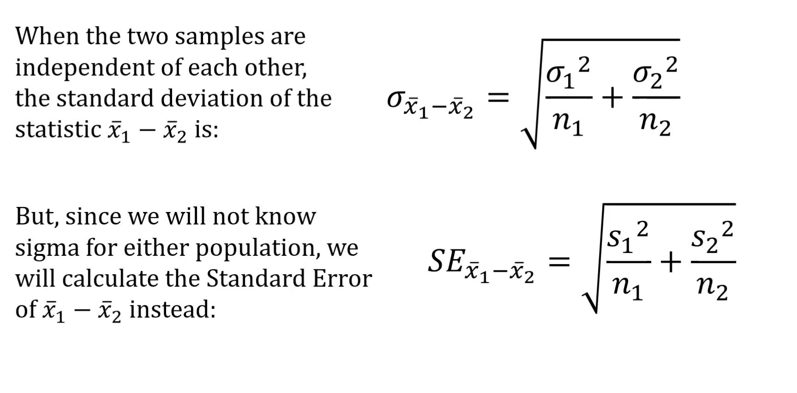

- **Types of Characteristics**
  - **Population Parameter (PP)**: $\theta$
    - characteristic of a the _entire_ population of interest (e.g., population mean, variance, proportion, etc.)
    - Fixed
  - **Sample Statistic (SS)**: $\hat{\theta}_n$ or $\hat{\theta}$
    - characteristic of a _sample_ of the population
    - You have some function $r$ that determines a characteristic (e.g., mean, variance, proportion, etc.) $\rightarrow$ apply to sample like $r(X_1, X_2, ..., X_n)$ $\rightarrow$ result is $\hat{\theta}_n$.
- **Mean**: Average
  - **Expected Value (EV)**: mean/average of a random variable
    - $E$ function represents EV, so $E(z)$ (or $E[z]$) is the EV (averge/mean) of $z$.
  - **Applied to Populations**:
    - $\mu = \sum_{i=1}^{N} x f(x)$ &nbsp; `population mean`
      - $f$ is the probability mass function (PMF) or probability density function (PDF) of the population.
  - **Applied to Samples**:
    - $\bar{X} = \frac{1}{n} \sum_{i=1}^{n} X_i$ &nbsp; `sample mean`
    - is unbiased estimator for the population mean $\mu$.
  - **Applied to Populations of Samples**:
    - $E(\bar{X}) = \mu$ &nbsp; `expected sample mean`
      - EV of the sample mean is the population mean.
        - The mean of all possible sample means is the population mean.
      - $\bar{X}$ is the mean of a sample. Across the distribution of all possible samples, the average of the sample means is the population mean. This is the law of large numbers.
- **Deviation**: Distance from $\mu$ (EV)
  - **Applied to Populations**:
    - $X - \mu$ &nbsp; `deviation`
      - Deviation of a random variable from its mean.
    - $E[(X - \mu)]$ &nbsp; `expected deviation`
      - Expected/average deviation of a random variable from its mean.
    - $E[(X - \mu)^2] \equiv E(X^2) - \mu^2 \equiv Var(X) \equiv \sigma^2$ &nbsp; `expected squared-deviation` `variance`
      - Magnitude of average deviation of a random variable from its mean.
      - Squaring makes it positive $\rightarrow$ deviation from mean in positive _or_ negative direction has same effect of increasing the value.
      - $E[(X - \mu)^2] \equiv E[(X - 2X\mu + \mu^2)] \equiv E(X^2) - 2\mu E(X) + \mu^2 \equiv E(X^2) - 2\mu^2 + \mu^2 \equiv E(X^2) - \mu^2$
        - Possible because $E(X) = \mu$ and because we can split out the $\mu$ from inside the $E$ function since it is a constant and not a random variable
  - **Applied to Samples**:
    - $X - \bar{X}$ &nbsp; `deviation`
      - Deviation of a random variable from the sample mean.
    - $E[(X - \bar{X})]$ &nbsp; `expected sample deviation`
      - Expected/average deviation of a random variable from the sample mean.
    - $E[(X - \bar{X})^2] \equiv E(X^2) - \bar{X}^2 \equiv S^2$ &nbsp; `sample variance`
- **Estimator**: rule/function that estimates a PP
- **Bias**: $Bias(\hat{\theta}) = E(\hat{\theta} - \theta) = E(\hat{\theta}) - \theta$ &nbsp; `average deviation of estimator from true PP`
  - **Variance of Estimate**: $Var(\hat{\theta}) = E[(\hat{\theta} - E(\hat{\theta}))^2]$ `average squared-deviation of estimator from its EV`
  - **Unbiased Estimator**: $Bias(\hat{\theta}) = 0$
    - estimator whose expected value is equal to the PP being estimated. On average it will correctly estimate the PP. $E(\hat{\theta}) = \theta$ — meaning that the estimator is centered around the true value of the parameter being estimated.
    - _Sample Mean_ ($\bar{X}$) is unbiased estimator for the population mean $\mu$.
      - $\bar{X} = \frac{1}{n} \sum_{i=1}^{n} X_i$
  - **Biased Estimator**: EV $\neq$ true PP.
    - _Sample Variance_ is a biased estimator for the population variance $\sigma^2$. To correct the bias, we divide by $n-1$ instead of $n$.
      - $S^2 = \frac{1}{n-1} \sum_{i=1}^{n} (X_i - \bar{X})^2$
  - **Mean Squared Error (MSE)**: $MSE(\hat{\theta}) = E[(\hat{\theta} - \theta)^2]$
    - It is variance, but instead of deviation from the mean, it is the point estimator's deviation from the true PP.
    - measure of how close an estimator is to the true PP.
    - **Applied to Biased Estimator**
      - $MSE(\hat{\theta}) = Var(\hat{\theta}) + Bias(\hat{\theta})^2$
    - **Applied to Unbiased Estimator**
      - $MSE(\hat{\theta}) = Var(\hat{\theta})$
        - $Bias(\hat{\theta}) = 0$ if unbiased
  - **Bias/Variance Tradeoff**:
    - Bias shifts the distribution of the estimator away from the true value
    - Variance flattens the distribution of the estimator
    - Eliminating bias increases variance and vice versa. Sometimes slightly biased estimators are preferred because they have lower variance and therefore give lower mean squared error (MSE).
- **Variance**: $Var(X) = E[(X - \mu)^2] = E(X^2) - \mu^2$
  - **Properties**:
    - $Var(aX) = a^2 Var(X)$
    - $Var(X + Y) = Var(X) + Var(Y) + 2Cov(X, Y)$
      - If $X$ and $Y$ are independent, then $Cov(X, Y) = 0$ and $Var(X + Y) = Var(X) + Var(Y)$.
    - $Var(X - Y) = Var(X) + Var(Y) - 2Cov(X, Y)$
    - $Var(aX + bY) = a^2 Var(X) + b^2 Var(Y) + 2abCov(X, Y)$
  - **Applied to Populations**:
    - $Var(X) = \sum_{i=1}^{N} (x - \mu)^2 f(x)$ &nbsp; `population variance`
      - $f$ is the probability mass function (PMF) or probability density function (PDF) of the population.
  - **Applied to Samples**:
    - $Var(\bar{X}) = \frac{\sigma^2}{n}$ &nbsp; `sample variance`
      - $\sigma^2$ is the population variance.
      - $\bar{X}$ is the sample mean.
      - $n$ is the sample size.
    - $Var(\bar{X}) = \frac{1}{n} \sum_{i=1}^{n} (X_i - \bar{X})^2$ &nbsp; `sample variance`
      - $X_i$ is the $i$th value in the sample.
      - $\bar{X}$ is the sample mean.
      - $n$ is the sample size.
  - **Applied to Populations of Samples**:
    - $Var(\bar{X}) = \frac{\sigma^2}{n}$ &nbsp; `expected sample variance`
      - $\sigma^2$ is the population variance.
      - $\bar{X}$ is the sample mean.
      - $n$ is the sample size.
      - The variance of the sample mean is the population variance divided by the sample size.
- **Covariance**: $Cov(X, Y) = E[(X - \mu_X)(Y - \mu_Y)]$
  - Numerical measure of the degree to which $X$ and $Y$ vary together.
  - $Cov(X, Y) = E[(X - \mu_X)(Y - \mu_Y)] = E(XY) - \mu_X \mu_Y$
  - $Cov(X, Y) > 0$ means $X$ and $Y$ are positively correlated.
  - $Cov(X, Y) < 0$ means $X$ and $Y$ are negatively correlated.
  - Properties:
    - $Cov(X, X) = Var(X)$
    - $Cov(X, Y) = Cov(Y, X)$
    - $Cov(aX, Y) = aCov(X, Y)$
    - $Cov(X + Y, Z) = Cov(X, Z) + Cov(Y, Z)$
    - $Cov(X, Y + Z) = Cov(X, Y) + Cov(X, Z)$
    - $Cov(aX + bY, cZ + dW) = acCov(X, Z) + adCov(X, W) + bcCov(Y, Z) + bdCov(Y, W)$
  - $Cov(X, Y) = 0$ does not imply independence, but independence implies $Cov(X, Y) = 0$.
  - **Correlation**: $Corr(X, Y) = \frac{Cov(X, Y)}{\sigma_X \sigma_Y}$
    - Normalizes the covariance to be between -1 and 1.
    - $Corr(X, Y) = 1$ means perfect positive linear relationship.
    - $Corr(X, Y) = -1$ means perfect negative linear relationship.
    - $Corr(X, Y) = 0$ means no linear relationship.
- **Pearson Correlation Coefficient**: $r = \frac{Cov(X, Y)}{\sigma_X \sigma_Y}$
  - $r$ is a measure of the strength and direction of a linear relationship between two variables.
  - $r$ is between -1 and 1.
  - $r = 1$ means perfect positive linear relationship.
  - $r = -1$ means perfect negative linear relationship.
  - $r = 0$ means no linear relationship.
  - $r$ is unitless.
  - $r$ is invariant to linear transformations of $X$ and $Y$.
  - $r$ is not invariant to nonlinear transformations of $X$ and $Y$.
  - $r$ is not invariant to outliers.
