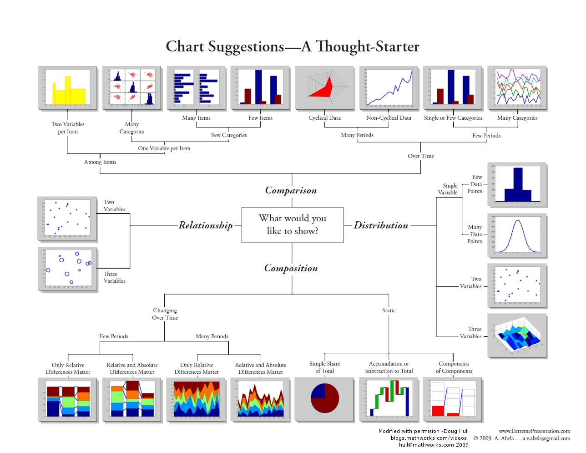

## Data Cleaning

- Time/Date data
  - Standardize time systems (UTC/GMT/Unix)
  - Standardize calendar systems (Julian/Gregorian)
- Financial data
  - Use $R_t$ (returns) metric to standardize value of currency since it may change over time
    - $R_t = \frac{P_{t+1} - P_t}{P_t}$
- Missing Values
  - Bad Solutions
    - Filling empty fields with 0/-1 $\rightarrow$ interpreted as actual data
    - Dropping rows with empty fields $\rightarrow$ lose info from the other fields in those rows/items
  - Good Solutions
    - Imputation (filling in empty values/cells)
      - Heuristic-based
        - E.g., year of death can be set to 80
      - Column mean
        - Doesn't change overall mean of feature
      - Nearest neighbor
        - Better than mean when systematic reasons to explain variance
      - Random val from same col
        - Permits statistical evaluation of the impact of imputation
      - Interpolation
        - Use linreg to predict missing vals
        - Work well if small number of missing cells
- Outlier
  - Detection
    - Depends on distribution type
      - Normal distribution
        - 99.7% of data within 3 std devs
        - Outlier = $|x - \mu| > 3\sigma$
      - Power-law distribution more difficult
    - Methods
      - Clustering
        - If data point far from cluster center $\rightarrow$ outlier
      - IQR
        - $\text{IQR} = Q_3 - Q_1$
        - $x < Q_1 - 1.5 \times IQR$ or $x > Q_3 + 1.5 \times IQR$ $\rightarrow$ outlier
  - Solutions
    - Fix underlying systemic cause of the outliers
    - Delete outliers prior to fitting model
      - If outliers caused by measurement error $\rightarrow$ deletion may yield better model
      - If outliers caused by model simplicity $\rightarrow$ deletion may yield worse model

## Data Visualization

- Exploratory Data Analysis (EDA)
  - Identify mistakes in data collection/preprocessing
    - Don't feed unvisualized data into an ML alg
  - Identify violations of statistical assumptions
  - Obsreve patterns in the data
  - Construct hypotheses

### Chart Selection

> _all information nested below is from the graphic/picture on slide 21_

- Want to show **Comparison**
  - Comparison over time
    - Many periods of time
      - Cyclical data $\rightarrow$ radar chart
      - Non-cyclical data $\rightarrow$ line chart
    - Few periods of time
      - Few categories $\rightarrow$ bar chart
      - Many categories $\rightarrow$ line chart with many lines
  - Comparison among items
    - Two variables per item $\rightarrow$ variable-width bar chart
    - One variable per item
      - Many categories $\rightarrow$ table with embedded bar charts
      - Few categories $\rightarrow$ bar chart horizontal or vertical
- Want to show **Relationship**
  - Relationship between two variables
    - Continuous $\rightarrow$ scatter plot
    - Categorical $\rightarrow$ box plot
  - Relationship among 3+ variables $\rightarrow$ scatter plot with variable colors/dotsizes
- Want to show **Composition**
  - Composition changing over time
    - Many periods of time
      - Relative differences matter $\rightarrow$ stacked area chart, y-range based on min/max of sample/data
      - Absolute and relative differences matter $\rightarrow$ stacked area chart, y-range is absolute possible range from population
    - Few periods of time
      - Relative differences matter $\rightarrow$ stacked bar chart, y-range based on min/max of sample/data
      - Absolute and relative differences matter $\rightarrow$ stacked bar chart, y-range is absolute possible range from population
  - Composition static
    - Simple share of total $\rightarrow$ pie chart
    - Accumulation or subtraction to total $\rightarrow$ waterfall chart
    - Components of components $\rightarrow$ stacked 100% bar chart with subcomponents
    - Accumulation to total and absolute differences matter $\rightarrow$ tree map
- Want to show **Distribution**
  - Single variable
    - Few data points $\rightarrow$ bar histogram
    - Many data points $\rightarrow$ line histogram (kernel density estimate/distribution curve line)
  - Two variables $\rightarrow$ scatter plot
  - Three variables $\rightarrow$ 3D scatter plot

### Visualizing Distributions

- Distribution describes
  - Set of values a variable can take
  - Frequency of each value
- ECDF: Empirical Cumulative Distribution Function
  - $F(x) = \frac{\text{number of data points} \leq x}{\text{total number of data points}}$
  - $F(x)$ is a step function
  - $F(x)$ is a good estimator of the CDF
- Quartiles
  - Q1 (first/lower quartile)
    - 25th percentile (25% of data below)
  - Q2 (median)
    - 50th percentile (50% of data below)
  - Q3 (third/upper quartile)
    - 75th percentile (75% of data below)
  - Range from Q1 to Q3 = middle 50% of data
  - IQR = Q3 - Q1
  - Box plot
    - Box = IQR
    - Whiskers = 1.5 \* IQR +/- Q1/Q3
    - Outliers = outside whiskers
- Variable types
  - Quantitative (numerical)
    - Continuous (real numbers)
    - Discrete (integers)
    - Chart choices
      - Line Chart
        - If no meaningful adjacency between data points, use fitted overlay curve
        - If adjacency matters (e.g., time series), use line chart
      - Scatter plots
        - Use heat map for better frequency visualization
          - Colored heat map reveales distribution better
        - Jittering: add random noise to data points to avoid overlap when difficult seeing overlapping/dense data points
      - Box plots (continuous)
      - Violion plots (continuous)
        - Gives width meaning (density)
      - Histogram
        - Collects data points with similar values into bins
        - Bin area = % of datapoints in it
      - Hex plots
        - Plot density of joint distribution
          - 2D histogram
          - xy-plane binned into hexagons
          - Darker hexagon = more points
      - Contour plots
        - Contour lines represent areas of equal density
  - Qualitative (categorical)
    - Ordinal (inherently ordered)
    - Nominal (no inherent order)
    - Chart choices
      - Bar Plots
        - Better than pie charts for comparisons or detecting differences
      - Pie charts
        - Better for percentages of whole
      - Stacked bar plots

### Principles of Data Visualization

- Lie Factor
  - $\frac{\text{size of effect in graphic}}{\text{size of effect in data}}$
  - Should be close to 1
  - Example with bar chart:
    - _size of effect in graphic_ = $\frac{\text{max physical height of bar on chart} - \text{min physical height of bar on chart}}{\text{min physical height of bar on chart}}$
    - _size of effect in data_ = $\frac{\text{max data value} - \text{min data value}}{\text{min data value}}$
- Graphical Integrity
  - Visual area and numerical measure
    - Bad to use area/volume to show 1D data
  - Offset distortion
    - E.g., not starting bar graphs at 0 when comparing two bars
  - Scale distortion
    - E.g., not using linear scale for data that should be linear
    - E.g., shrinking graph s.t. y-axis has less physical space than x-axis making slope look steeper
      - Golden rule: aspect ratio $w = 1.6 \times h$
  - Omitting context
    - E.g., not including point of reference
- Data-Ink Ratio
  - $\frac{\text{data-ink}}{\text{total ink used to print graphic}}$
  - Goal: Maximize data-ink ratio (minimize ink used for non-data elements)
  - Methods: remove gridlines, remove colors, remove borders, etc.
- Transformations
  - Motivation: better visualize/understand relationship between variables
  - Types
    - Few outliers at large $x$ $\rightarrow$ log transformation $x$
    - Heavy density at large $y$ $\rightarrow$ power transformation $y$
