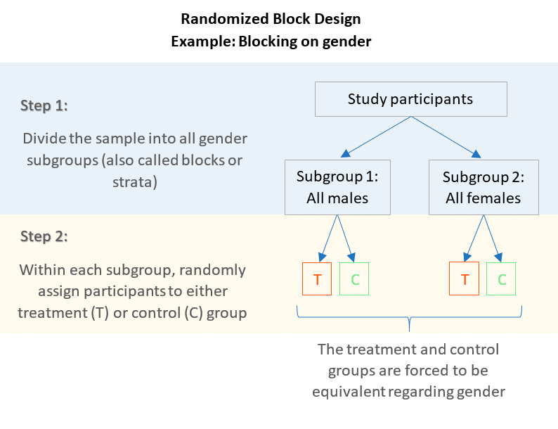
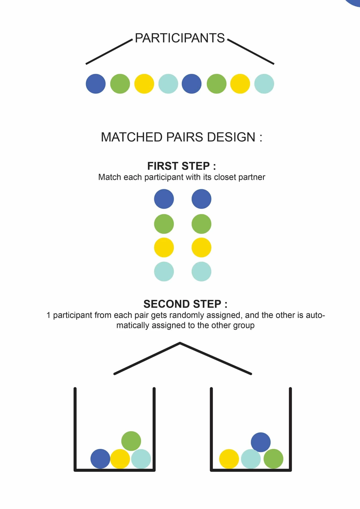
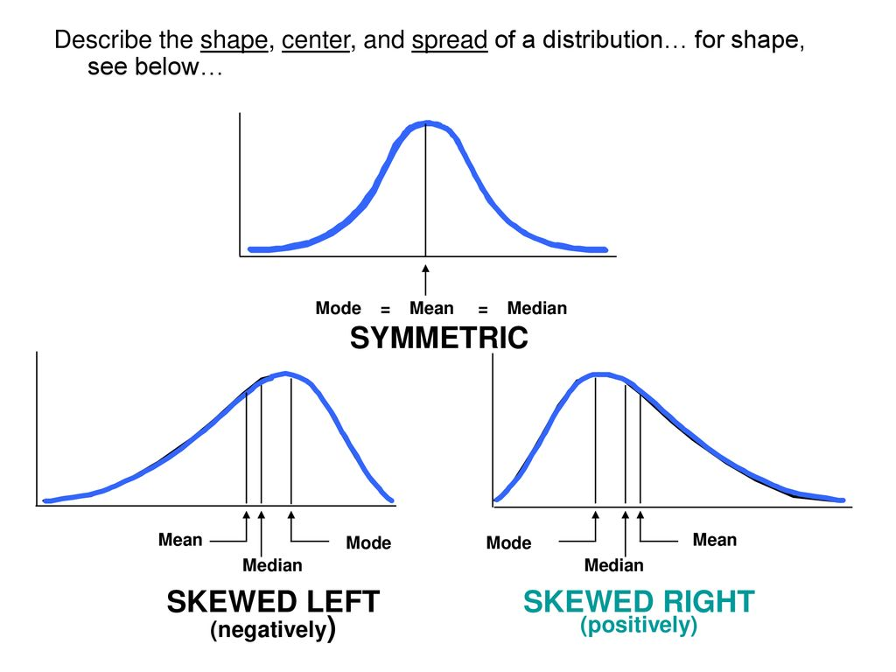
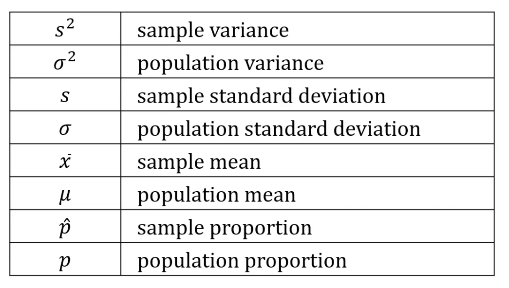
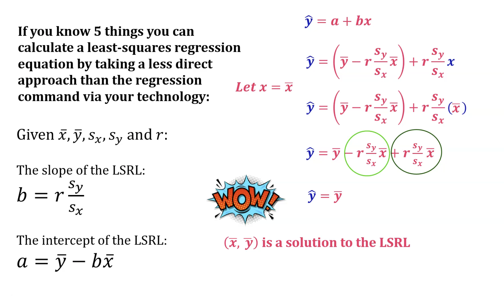

- [Sampling Methods](#sampling-methods)
  - [Convenience Sampling](#convenience-sampling)
    - [How it works:](#how-it-works)
    - [When to use convenience sampling:](#when-to-use-convenience-sampling)
    - [Advantages:](#advantages)
    - [Disadvantages:](#disadvantages)
  - [Cluster Sampling](#cluster-sampling)
    - [How it works:](#how-it-works-1)
    - [When to use cluster sampling:](#when-to-use-cluster-sampling)
    - [Advantages:](#advantages-1)
    - [Disadvantages:](#disadvantages-1)
  - [Euler Sampling](#euler-sampling)
    - [Key steps:](#key-steps)
    - [Advantages:](#advantages-2)
    - [Disadvantages:](#disadvantages-2)
  - [Simple Random Sampling](#simple-random-sampling)
  - [Stratified Random Sampling](#stratified-random-sampling)
  - [Systematic Sampling](#systematic-sampling)
- [Experimental Design](#experimental-design)
  - [Block Design](#block-design)
  - [Matched Pairs Design](#matched-pairs-design)
- [Graphs](#graphs)
  - [Terminology](#terminology)
  - [Skew](#skew)
- [Describing Distributions with Numbers](#describing-distributions-with-numbers)
  - [Center](#center)
    - [Variable Types](#variable-types)
      - [Qualitative](#qualitative)
      - [Quantitative](#quantitative)
  - [Mean, Median, Mode](#mean-median-mode)
    - [Skew Affects Measures of Center](#skew-affects-measures-of-center)
  - [P-hat](#p-hat)
  - [Resistance](#resistance)
- [Describing Variability in a Data Set](#describing-variability-in-a-data-set)
  - [Relevant Notation](#relevant-notation)
  - [Sample Variance](#sample-variance)
  - [Sample Standard Deviation](#sample-standard-deviation)
  - [Quartiles](#quartiles)
  - [IQR](#iqr)
  - [Algorithm for Determining Outliers](#algorithm-for-determining-outliers)
  - [The Empirical Rule](#the-empirical-rule)
  - [Normal Distribution](#normal-distribution)
  - [Z-Score](#z-score)
  - [Frequency Distribution](#frequency-distribution)
    - [Approximating Percentiles from a Frequency Distribution](#approximating-percentiles-from-a-frequency-distribution)
- [Bivariate Data](#bivariate-data)
  - [Scatter Plots](#scatter-plots)
  - [Correlation Coefficient](#correlation-coefficient)
    - [Properties of the Correlation Coefficient](#properties-of-the-correlation-coefficient)
    - [Descriptive Ranges](#descriptive-ranges)
  - [Least Squares Regression Line](#least-squares-regression-line)
    - [Deriving the Least Squares Regression Line Alge](#deriving-the-least-squares-regression-line-alge)
    - [Properties of the Least Squares Regression Line](#properties-of-the-least-squares-regression-line)
    - [Residual Values](#residual-values)
      - [Residual Plot](#residual-plot)
    - [Influential Points](#influential-points)
  - [Coefficient of Determination](#coefficient-of-determination)
    - [Extended Explanation with BMI Example](#extended-explanation-with-bmi-example)
- [Probability](#probability)
  - [Terminology](#terminology-1)
  - [Syntax](#syntax)
  - [Rules](#rules)
    - [Formulas](#formulas)
  - [Binomial Probability](#binomial-probability)
    - [Cumulative Binomial Probability](#cumulative-binomial-probability)
      - [Difference `binompdf` and `binomcdf`](#difference-binompdf-and-binomcdf)
    - [Probability of a Range of Successes](#probability-of-a-range-of-successes)
    - [Expected Number of Successes](#expected-number-of-successes)
    - [Mean of a Binomial Distribution](#mean-of-a-binomial-distribution)
    - [Variance of a Binomial Distribution](#variance-of-a-binomial-distribution)
    - [Standard Deviation of a Binomial Distribution](#standard-deviation-of-a-binomial-distribution)
      - [Probability of the Number of Successes being within one Standard Deviation of the Mean](#probability-of-the-number-of-successes-being-within-one-standard-deviation-of-the-mean)

# Sampling Methods

*Summary*

- In cluster sampling, you randomly select entire groups (clusters).
- In stratified random sampling, you randomly select individuals from within each subgroup (stratum).
- In systematic sampling, you select members of the population at a regular interval.
- In convenience sampling, you select participants based on ease of access, availability, or proximity to the researcher.
- In Euler sampling, you approximate the solution of differential equations using the Euler method.
- In simple random sampling, each member of the population has an equal chance of being selected for the sample.

## Convenience Sampling

Convenience sampling is a non-probability sampling method where the sample is selected based on ease of access, availability, or proximity to the researcher. It's a quick and inexpensive way to gather data, but it can lead to biased results.

### How it works:

- Identify the target population: Determine who you want to study.
- Select participants: Choose individuals who are readily available and willing to participate. This could include friends, family, colleagues, or people passing by in a public place.
- Collect data: Gather information from the selected participants.

### When to use convenience sampling:

- Pilot studies: It's often used in the early stages of research to gather preliminary data and test research instruments.
- Exploratory research: It can be helpful for generating ideas and hypotheses for further investigation.
- Qualitative research: It's sometimes used in qualitative research when the goal is to gain in-depth insights rather than make generalizations.

**Example**:

A researcher wants to gather opinions on a new product. They stand outside a shopping mall and ask passersby to complete a short survey. This is a convenience sample because the participants are chosen based on their proximity and willingness to participate at that moment.

### Advantages:

- Ease of access: Participants are readily available and easy to recruit.
- Cost-effective: It's a relatively inexpensive method of data collection.
- Quick results: Data can be gathered quickly and easily.

### Disadvantages:

- Non-representative: Convenience samples are not representative of the larger population, leading to biased results.
- Limited generalizability: Findings cannot be generalized to the broader population.
- Potential for bias: Participants may not be typical of the target population, and their responses may not be representative of others' views.

**Important note**:

Convenience sampling is not a rigorous sampling method and should be used with caution, especially when the goal is to make generalizations about a larger population. It's crucial to acknowledge the limitations of this method and consider the potential biases in your findings.

## Cluster Sampling

Cluster sampling is a probability sampling method where the researcher divides the population into smaller groups known as clusters. Then, a random sample of these clusters is selected. All observations within the chosen clusters are included in the sample.

### How it works:

- Divide: The population is divided into clusters. These clusters should ideally be diverse and representative of the entire population.
- Select: A random sample of clusters is chosen.
- Include: All individuals within the selected clusters are included in the sample.

### When to use cluster sampling:

- Large populations: Cluster sampling is often used when the population is large and spread out geographically. It is more efficient than trying to sample individuals from the entire population.
- Limited resources: It can be a cost-effective method when resources are limited.
- Natural groupings: When natural groupings (like schools, cities, or neighborhoods) exist within the population, cluster sampling can be a convenient way to select a sample.

**Example**:

A researcher wants to study the reading habits of high school students in the United States. Instead of randomly selecting individual students from across the country, they could use cluster sampling. They might first divide the population into clusters based on states, then randomly select a few states. Finally, they would survey all high school students within the selected states.

### Advantages:

- Cost-effective: It can be less expensive and time-consuming than other sampling methods.
- Convenient: It is easier to implement when natural groupings exist.

### Disadvantages:

- Higher sampling error: Cluster samples tend to have higher sampling error than simple random samples.
- Less precise: It may not be as precise as other sampling methods if the clusters are not representative of the population.

## Euler Sampling

Euler sampling (or the Euler method) is not a sampling method for selecting individuals from a population like cluster sampling or stratified random sampling. Instead, it's a numerical method used in different fields, including statistics and machine learning, to approximate the solution of differential equations.

**How it works in the context of differential equations**:

The Euler method is a simple and intuitive way to approximate the solution of an ordinary differential equation (ODE).  It works by starting at an initial value and taking small steps forward in time, using the derivative of the function at each point to estimate the next value.

### Key steps:

- Start: Begin with an initial value for the function.
- Step: Choose a small time step (denoted as 'h').
- Calculate: Estimate the next value of the function using the current value and the derivative at that point:
  `new_value = current_value + h * derivative(current_value)`
- Repeat: Repeat steps 2 and 3 for the desired number of iterations or until a stopping condition is met.
When is it used in machine learning:

In machine learning, Euler sampling (or variations of it) is often used in diffusion models, which are a type of generative model. Diffusion models work by gradually adding noise to data and then learning to reverse this process to generate new data samples. The Euler method can be used to approximate the diffusion process and the reverse process for generating samples.

### Advantages:

- Simple: It is easy to understand and implement.
- Computational efficiency: It is computationally efficient, especially for simple problems.

### Disadvantages:

- Accuracy: The Euler method can be inaccurate, especially for large time steps or complex problems. The error tends to accumulate as more steps are taken.
- Stability: It can be unstable for certain types of differential equations, meaning that the approximation can diverge from the true solution.
 

## Simple Random Sampling

Simple random sampling (SRS) is a probability sampling method in which each member of the population has an equal chance of being selected for the sample. It's considered the most basic and unbiased sampling technique.

How it works:

Identify the population: Define the entire group you want to study.
Assign numbers: Assign a unique number to each member of the population.
Use a random number generator: Use a random number generator (or other random selection method like a lottery) to select individuals from the population based on their assigned numbers.
Continue until the desired sample size is reached: Keep selecting individuals until you have the desired number of participants in your sample.
When to use simple random sampling:

Homogeneous populations: It works best when the population is relatively uniform, and there are no specific subgroups you want to over-represent or under-represent.
Generalizability: When you want to make inferences about the larger population based on your sample, SRS provides the most unbiased and generalizable results.
Basic research: It's often used in the early stages of research to gather preliminary data and test research hypotheses.
Example:

A researcher wants to study the opinions of college students about a new campus policy. They obtain a list of all registered students and assign each student a number. Then, they use a random number generator to select 100 students for the sample.

Advantages:

Unbiased: Each member of the population has an equal chance of being selected, minimizing the risk of bias.
Simple: It's easy to understand and implement.
Generalizable: Results can be generalized to the larger population with a high degree of confidence.
Disadvantages:

Difficult with large populations: It can be difficult to implement with very large populations, as it requires a list of all members.
May not capture all subgroups: If the population is diverse, SRS may not adequately represent all subgroups, especially if they are small in size.
Can be inefficient: It may not be the most efficient method if there are natural groupings in the population that could be exploited using other sampling techniques (like stratified or cluster sampling).

## Stratified Random Sampling

Stratified random sampling is another probability sampling method, but it differs from cluster sampling in a key way:

How it works:

Divide: The population is divided into subgroups called strata based on specific characteristics (e.g., age, gender, income level).
Sample: A random sample is taken from each stratum, proportional to the stratum's size in the population.
Combine: The samples from each stratum are combined to form the final sample.
When to use stratified random sampling:

Heterogeneous populations: This method is particularly useful when the population is diverse and you want to ensure that each subgroup is represented in the sample.
Comparison of subgroups: It allows for comparisons between different subgroups within the population.
Increased precision: Stratified random sampling can often lead to more precise estimates than simple random sampling, especially when the strata are homogeneous within themselves but heterogeneous between each other.
Example:

A researcher wants to study the opinions of voters on a new policy. They could use stratified random sampling to divide the population into strata based on age groups (e.g., 18-29, 30-49, 50-64, 65+). They would then randomly select individuals from each age group, ensuring that the final sample reflects the age distribution of the voting population.

Advantages:

Representativeness: Ensures that each subgroup is represented in the sample.
Precision: Can lead to more precise estimates than simple random sampling.
Comparison: Allows for comparisons between different subgroups.
Disadvantages:

Requires knowledge of population: You need to know the characteristics of the population to create the strata.
More complex: It can be more complex and time-consuming to implement than simple random sampling.
Key difference from cluster sampling:

In cluster sampling, you randomly select entire groups (clusters).
In stratified random sampling, you randomly select individuals from within each subgroup (stratum).

## Systematic Sampling

Systematic sampling is a probability sampling method where researchers select members of the population at a regular interval. It is a simple and efficient way to select a sample from a larger population.

How it works:

Determine the sampling interval: Divide the population size (N) by the desired sample size (n). This gives you the sampling interval (k).
Choose a random starting point: Select a random number between 1 and k. This is your starting point.
Select samples: Select every kth individual from the starting point until you reach the desired sample size.
Example:

If you have a population of 1000 people and want a sample size of 100, your sampling interval would be 10 (1000 / 100 = 10). You would then randomly select a starting point between 1 and 10. If you choose 3, your sample would include the 3rd person, the 13th person, the 23rd person, and so on.

When to use systematic sampling:

Large populations: Systematic sampling is often used when the population is large and it is not feasible to create a list of every individual.
Ordered lists: It is most effective when the population can be easily listed or ordered.
Advantages:

Simplicity: It is a simple and easy-to-use method.
Efficiency: It can be more efficient than simple random sampling, especially when the population is large.
Spread: It can ensure that the sample is spread evenly across the population.
Disadvantages:

Periodicity: If there is a pattern in the population list, systematic sampling may lead to biased results.
Less random: It is not as random as simple random sampling, as the starting point is chosen randomly, but the rest of the sample is determined by the interval.
I hope this explanation is helpful! Let me know if you have any other questions.

# Experimental Design

- **Direct Control**: The researcher manipulates the independent variable directly. Hold constant any variables beleieved to affect the dependent variable.
- **Random Assignment**: Participants are randomly assigned to different levels of the independent variable. This helps to control for individual differences and ensures that the groups are comparable.
- **Replication**: Have enough subjects/experimental units so that we can tell a real difference from a chance difference.
- **Blocking**: Grouping similar experimental units together and then randomizing within the blocks. This helps to control for variables that may affect the dependent variable. The blocks are similar with respect to some extraneous variable that is expected to affect the dependent variable. Within the block, treatments are randomly assigned.
- **Balancing**: Each treatment is assigned the same number of times to each block.
- **Factorial Design**: A design in which all possible combinations of two or more levels of two or more factors are studied. This allows for the examination of main effects and interactions between factors.
- **Placebo Effect**: A psychological phenomenon in which the belief that one is receiving treatment leads to an improvement in symptoms, even if the treatment is inert.
- **Blinding**: Participants are unaware of which treatment they are receiving. This helps to control for the placebo effect.
- **Double-Blind**: Both the participants and the researchers are unaware of which treatment is being administered. This helps to control for bias in the results.
- **Matched Pairs Design**: A design in which each subject receives both treatments, or subjects are matched based on similar characteristics and then randomly assigned to different treatments -- " is a randomized blocked experiment in which each block consists of a matching pair of similar experimental units."
- **Statistically Significant**: A result is considered statistically significant if it is unlikely to have occurred by chance alone. This is typically determined using a significance level of 0.05.A statistically significant association in data from a well-designed experiment *does imply causation*.

## Block Design

In a block design, the experimental units are grouped into blocks based on some extraneous variable that is expected to affect the dependent variable. Within each block, the treatments are randomly assigned to the experimental units. This helps to control for the extraneous variable and reduce variability in the data.

## Matched Pairs Design

# Graphs

## Terminology

- **Frequency**: The number of times a value occurs in a data set.
- **Relative Frequency**: The proportion of times a value occurs in a data set, calculated as the frequency of the value divided by the total number of values.
- **Bar Graph**: A graphical representation of categorical data using bars of different heights or lengths.
- **Histogram**: A graphical representation of quantitative data using bars of different heights to show the frequency or relative frequency of values within intervals or bins.
- **Variable**: A characteristic or attribute that can take on different values.
- **Categorical Variable**: A variable that represents categories or groups.
- **Label**: A descriptive name or category assigned to a variable.
- **Cases**: The individual units of data in a data set.

## Skew

# Describing Distributions with Numbers

## Center

### Variable Types

#### Qualitative

Qualitative variables are categorical variables that represent categories or groups. They can be further classified into two types:

- **Nominal variables**: These variables represent categories with no inherent order or ranking. Examples
  - Eye color
  - Marital status
  - Favorite color
  - Zip code
  - Usually represented by bar graphs or pie charts
- **Binary variables**: These variables have only two categories. Examples
  - Yes/no
- **Ordinal variables**: These variables represent categories with a natural order or ranking. Examples
  - Education level (e.g., high school, college, graduate school)
  - Income level (e.g., low, medium, high)
  - Likert scale responses (e.g., strongly agree, agree, neutral, disagree, strongly disagree) 

#### Quantitative

Quantitative variables are numerical variables that represent quantities or amounts. They can be further classified into two types:

- **Discrete variables**: These variables take on specific values and cannot be broken down into smaller units. Examples
  - Number of siblings
  - Number of pets
  - Number of students in a class
  - Usually represented by bar graphs or pie charts
- **Continuous variables**: These variables can take on any value within a range. Examples
  - Height
  - Weight
  - Temperature
  - Usually represented by histograms or line graphs

| Feature |	Discrete Data |	Continuous Data
| --- | --- | --- |
| Values |	Separate, distinct (often whole numbers) |	Any value within a range
| Measurement |	Counted |	Measured
| Representation |	Bar graphs, pie charts |	Histograms, line graphs
| Examples |	Number of items, occurrences |	Height, weight, temperature, time
| Additional notes |	Can sometimes include specific fractions |	Can be infinitely divided within its range

## Mean, Median, Mode

- **Mean**: The average of a set of numbers. It is calculated by adding up all the numbers and dividing by the total number of values.
- **Median**: The middle value in a set of numbers when they are arranged in order. If there is an even number of values, the median is the average of the two middle values.
- **Mode**: The value that appears most frequently in a set of numbers. A set of numbers can have no mode, one mode, or multiple modes.

### Skew Affects Measures of Center

- **Symmetric distribution**: The mean, median, and mode are all equal and located at the center of the distribution.
- **Positively skewed distribution (right-skewed)**: The mean is greater than the median, which is greater than the mode. The tail of the distribution extends to the right.
- **Negatively skewed distribution (left-skewed)**: The mean is less than the median, which is less than the mode. The tail of the distribution extends to the left.

*Note*: just because mean and median are very close together, it doesn't necessitate that there are no outliers. It could be that the outliers are on both sides of the distribution, cancelling each other out. Or, it could be that the outliers are in the middle of the distribution, also cancelling each other out. Or, it could be that the outliers do not affect the mean and median enough to make a difference.

Different plots can reveal or obscure some aspects of the data distribution. For example, a box plot can show the presence of outliers, while a histogram can show the shape of the distribution. It's important to choose the right type of plot based on the data and the research question.

## P-hat

P-hat is a sample proportion that estimates the population proportion. It is calculated by dividing the number of successes by the total number of observations in the sample. The formula for p-hat is:

$$\hat{p} = \frac{x}{n}$$

Where:

- $\hat{p}$ is the sample proportion.
- x is the number of successes in the sample.
- n is the total number of observations in the sample.

## Resistance

- **Resistance**: A measure of how much a statistic is affected by extreme values (outliers) in the data. A resistant statistic is not greatly influenced by outliers, while a non-resistant statistic can be significantly affected by outliers.
- **Mean**: The mean is not resistant to outliers because it takes into account the value of each observation. A single extreme value can greatly affect the mean.
- **Median**: The median is resistant to outliers because it is not influenced by the exact value of each observation. It is the middle value when the data is ordered, so extreme values have less impact on the median.
- **Mode**: The mode is not affected by outliers because it is simply the most frequent value in the data. Outliers do not change the mode unless they are the most frequent value.
- **Range**: The range is not resistant to outliers because it is calculated using the maximum and minimum values in the data. A single extreme value can greatly affect the range.
- **Interquartile Range (IQR)**: The IQR is resistant to outliers because it is based on the middle 50% of the data. It is calculated as the difference between the third quartile (Q3) and the first quartile (Q1), so extreme values have less impact on the IQR.
- **Standard Deviation**: The standard deviation is not resistant to outliers because it takes into account the distance of each observation from the mean. Extreme values can greatly affect the standard deviation.
- **Variance**: The variance is not resistant to outliers because it is calculated as the average of the squared differences between each observation and the mean. Extreme values can greatly affect the variance.

# Describing Variability in a Data Set

- **Range**: The difference between the maximum and minimum values in a data set. It provides a simple measure of the spread of the data, but it is sensitive to outliers.
- **Interquartile Range (IQR)**: The range of the middle 50% of the data. It is calculated as the difference between the third quartile (Q3) and the first quartile (Q1). The IQR is resistant to outliers and provides a measure of the spread of the central portion of the data.
- **Variance**: The average of the squared differences between each data point and the mean. It measures the average deviation of each data point from the mean. The variance is sensitive to outliers.
- **Standard Deviation**: The square root of the variance. It provides a measure of the spread of the data in the same units as the original data. The standard deviation is sensitive to outliers.
- **Coefficient of Variation (CV)**: The standard deviation divided by the mean, expressed as a percentage. It provides a measure of relative variability in the data, allowing for comparison between data sets with different units or scales.

## Relevant Notation

## Sample Variance

> The sample variance is a measure of the spread of the data points in a sample. It is calculated as the average of the squared differences between each data point and the sample mean. The formula for the sample variance is:

$$s^2 = \frac{\sum_{i=1}^{n} (x_i - \bar{x})^2}{n-1}$$

Where:
- $s^2$ is the sample variance.
- $x_i$ is each data point in the sample.
- $\bar{x}$ is the sample mean.
- n is the number of data points in the sample.

The denominator n-1 is used to correct for bias in the estimation of the population variance.

The sample variance is used to estimate the population variance when the entire population is not available.

## Sample Standard Deviation

> The sample standard deviation is the square root of the sample variance. It provides a measure of the spread of the data points in a sample in the same units as the original data. The formula for the sample standard deviation is:

$$s = \sqrt{s} = \sqrt{\frac{\sum_{i=1}^{n} (x_i - \bar{x})^2}{n-1}}$$

Where:
- s is the sample standard deviation.

The sample standard deviation is commonly used in statistics to describe the variability of a data set. It is sensitive to outliers and provides a measure of the dispersion of the data points around the mean.

The standard deviation and variance are not resistant to outliers because they are based on the squared differences between each data point and the mean. Extreme values can greatly affect the standard deviation and variance, making them less robust measures of variability in the presence of outliers.

## Quartiles

> Quartiles are values that divide a data set into four equal parts. The quartiles are denoted as Q1, Q2, and Q3, representing the 25th, 50th, and 75th percentiles of the data, respectively. The formula for calculating the quartiles is:

$$Q1 = \frac{n+1}{4}$$

$$Q2 = \frac{2(n+1)}{4}$$

$$Q3 = \frac{3(n+1)}{4}$$

Where:
- Q1 is the first quartile (25th percentile).
- Q2 is the second quartile (50th percentile or median).
- Q3 is the third quartile (75th percentile).
- n is the number of data points in the sample.

The quartiles provide a way to divide the data into four equal parts, each containing 25% of the data points. They are used to describe the spread of the data and identify outliers.

## IQR

> The interquartile range (IQR) is a measure of the spread of the middle 50% of the data points in a data set. It is calculated as the difference between the third quartile (Q3) and the first quartile (Q1). The formula for the IQR is:

## Algorithm for Determining Outliers

1. Calculate the first quartile (Q1) and third quartile (Q3) of the data set.
2. Calculate the interquartile range (IQR) as the difference between Q3 and Q1.
3. Determine the lower bound as Q1 - 1.5 * IQR and the upper bound as Q3 + 1.5 * IQR.
4. Identify any data points that fall below the lower bound or above the upper bound as potential outliers.

## The Empirical Rule

- The empirical rule is a statistical rule that states that for a normal distribution:
  - Approximately 68% of the data falls within one standard deviation of the mean.
  - Approximately 95% of the data falls within two standard deviations of the mean.
    - Thus, 27% of the data falls between one and two standard deviations from the mean.
      - Thus, 13.5% of the data falls between one and two standard deviations from the mean on one side.
  - Approximately 99.7% of the data falls within three standard deviations of the mean.

## Normal Distribution

- A normal distribution is a symmetric, bell-shaped distribution that is characterized by the mean and standard deviation. In a normal distribution:
  - The mean, median, and mode are all equal and located at the center of the distribution.
  - Approximately 68% of the data falls within one standard deviation of the mean.
  - Approximately 95% of the data falls within two standard deviations of the mean.
  - Approximately 99.7% of the data falls within three standard deviations of the mean.
  - The distribution is symmetric around the mean, with the tails extending to infinity in both directions.

## Z-Score

- A z-score is a measure of how many standard deviations a data point is from the mean of a data set. It is calculated as:
  - $$z = \frac{x - \mu}{\sigma}$$
  - Where:
    - z is the z-score.
    - x is the data point.
    - $\mu$ is the mean of the data set.
    - $\sigma$ is the standard deviation of the data set.

## Frequency Distribution

`Charts and Graphs` => `Histograms` => Set the `Bin/Class Width` and `Starting Point` => `Recalculate Graph`

- A frequency distribution is a table that shows the number of times each value occurs in a data set. It provides a summary of the data and allows for easy comparison of different values. A frequency distribution can be used to create histograms, bar graphs, and other visual representations of the data.
- A frequency distribution can be used to identify patterns, trends, and outliers in the data. It can also help to identify the most common values and the spread of the data.
- A frequency distribution can be used to summarize categorical and quantitative data. For categorical data, the frequency distribution shows the number of times each category occurs. For quantitative data, the frequency distribution shows the number of times each value occurs within a certain range or interval

Frequency Distributions are made with the following steps:
1. Determine the range of the data.
2. Divide the range into intervals or classes.
3. Count the number of data points that fall into each interval.
4. Create a table that shows the intervals and the frequency of data points in each interval.
5. Create a histogram or bar graph to visualize the frequency distribution.
6. Analyze the frequency distribution to identify patterns, trends, and outliers in the data.

### Approximating Percentiles from a Frequency Distribution

- **Percentile**: A value below which a certain percentage of data falls. For example, the 25th percentile is the value below which 25% of the data falls.
- **Cumulative Frequency**: The sum of the frequencies up to a certain point in a frequency distribution. It represents the total number of data points up to that point.

# Bivariate Data

- **Bivariate data**: Data that involves two variables and their relationship to each other. Bivariate data can be analyzed using scatter plots, correlation coefficients, and regression analysis.
- **Scatter plot**: A graphical representation of bivariate data that shows the relationship between two variables. Each data point is plotted on the graph with one variable on the x-axis and the other variable on the y-axis.
- **Correlation coefficient**: A measure of the strength and direction of the relationship between two variables. The correlation coefficient ranges from -1 to 1, with -1 indicating a perfect negative relationship, 1 indicating a perfect positive relationship, and 0 indicating no relationship.
- **Regression analysis**: A statistical method used to model the relationship between two or more variables. It can be used to predict the value of one variable based on the value of another variable.
- **Positive relationship**: A relationship between two variables in which an increase in one variable is associated with an increase in the other variable. The correlation coefficient is positive.
- **Negative relationship**: A relationship between two variables in which an increase in one variable is associated with a decrease in the other variable. The correlation coefficient is negative.
- **No relationship**: A relationship between two variables in which there is no consistent pattern or association between the variables. The correlation coefficient is close to 0.
- **Linear relationship**: A relationship between two variables that can be represented by a straight line on a scatter plot. The correlation coefficient measures the strength and direction of the linear relationship.
- **Nonlinear relationship**: A relationship between two variables that cannot be represented by a straight line on a scatter plot. The correlation coefficient may not accurately capture the relationship between the variables.
- **Causation**: A relationship between two variables in which one variable directly influences the other variable. Correlation does not imply causation, and other factors may be influencing the relationship between the variables.

## Scatter Plots

- A scatterplot displays the relative strength, direction, and form of the relationship between two numerical variables.
- Strength: The strength of the relationship between two variables is determined by how closely the points in the scatterplot cluster around a line.

## Correlation Coefficient

The correlation coefficient is a measure of the strength and direction of the relationship between two variables.

The correlation coefficient ranges from -1 to 1, with -1 indicating a perfect negative relationship, 1 indicating a perfect positive relationship, and 0 indicating no relationship.
- To find the correlation coefficient, you can use the formula:
  - $$r = \frac{\sum (x_i - \bar{x})(y_i - \bar{y})}{\sqrt{\sum (x_i - \bar{x})^2 \sum (y_i - \bar{y})^2}}$$
  - The summation of the products for the z-scores of the two variables divided by the number of data points minus 1.
  - The points are standardized by subtracting the mean and dividing by the standard deviation.

It is not resistant to outliers because it varies with mean and standard deviation which themselves are affected by outliers.

> A sample correlation $r$ measures the strength of the *linear* relationship between two *quantitative* variables. It is calculated as the average of the products of the z-scores of the two variables.

### Properties of the Correlation Coefficient

- Always between -1 and 1
- $r > 0$ indicates a positive relationship
- $r < 0$ indicates a negative relationship
- Values or $r$ near $0$ indicate a very weak linear relationship
- As $r$ moves away from $0$ towards $1$ or $-1$, the strength of the linear relationship increases
- The extreme values $r = 1$ and $r = -1$ indicate a perfect linear relationship
- The value of $r$ does not depend on which variable is considered the explanatory variable and which is considered the response variable
- $r$ has no units since they cancel out in the calculation
- $r$ does not change when the units of measurement of the variables change or are transformed
- The value of $r$ does not describe curved relationships, no matter how strong the relationship is

### Descriptive Ranges

- $r = 0$: No correlation
- $|r| < 0.5$: Weak correlation
- $0.5 \leq |r| < 0.8$: Moderate correlation
- $|r| \geq 0.8$: Strong correlation
- $|r| = 1$: Perfect correlation

## Least Squares Regression Line

- The least squares regression line is the line that minimizes the sum of the squared differences between the observed values and the predicted values.
- The equation of the least squares regression line is:
  - $y = a + bx$
  - where $a$ is the y-intercept and $b$ is the slope of the line.
  - The slope $b$ is calculated as:
    - $b = r \frac{s_y}{s_x}$
    - where $r$ is the correlation coefficient between x and y, $s_y$ is the standard deviation of y, and $s_x$ is the standard deviation of x.
  - The y-intercept $a$ is calculated as:
    - $a = \bar{y} - b \bar{x}$
    - where $\bar{y}$ is the mean of y and $\bar{x}$ is the mean of x.
- The least squares regression line can be used to predict the value of y for a given value of x.

### Deriving the Least Squares Regression Line Alge

### Properties of the Least Squares Regression Line

- The LSRL passes through the point $(\bar{x}, \bar{y})$.
- The distinction between the explanatory and response variables is essential in the context of the LSRL.
- The sign of the slope of the LSRL matches the sign of the correlation coefficient.
- Don't use a LSRL to extrapolate beyond the range of the data because the relationship may not hold outside the range of the data.

### Residual Values

> $e = y - \hat{y}$
>
> Where:
> - $e$ is the residual value.
> - $y$ is the observed value.
> - $\hat{y}$ is the predicted value.

#### Residual Plot

- A residual plot is a graph that shows the residuals on the vertical axis and the independent variable on the horizontal axis.
- The residuals are the differences between the observed values and the predicted values from the regression line.
- A residual plot can help identify patterns or trends in the residuals, which can indicate problems with the regression model.
- Ideally, the residuals should be randomly scattered around the horizontal axis with no clear pattern. If there is a pattern, it may indicate that the regression model is not appropriate for the data.
- A U-shaped pattern in the residuals may indicate that the relationship between the variables is not linear.
- A funnel-shaped pattern in the residuals may indicate that the variance of the residuals is not constant across the range of the independent variable.
- A residual plot can be used to check the assumptions of the regression model and identify potential problems with the model.

### Influential Points

- An influential point is a data point that has a significant impact on the regression model.
- Influential points can affect the slope, intercept, and overall fit of the regression line.
- Influential points can be identified by examining the residuals, leverage, and Cook's distance.
- Leverage is a measure of how much a data point influences the regression model. Points with high leverage have a large impact on the regression line.
- Cook's distance is a measure of how much the regression coefficients change when a data point is removed from the model. Points with high Cook's distance are considered influential.

## Coefficient of Determination

The square of the correlation, $r^2$, is called the *Coefficient of Determination*. It measures the proportion of the variability in the response variable that can be explained by the explanatory variable.

$r^2$ is the fraction of the variation in values of y that is explained by the least squares regression of $y$ on $x$.

Example: If $r = -.3149 \Rightarrow r^2 = .0991$. This means that 9.91% of the variation in the values of $y$ can be explained by the least squares regression of $y$ on $x$ -- i.e., 9.91% of the variation can be explained by the linear relationship between $x$ and $y$.

If $\text{species} = 585.14 - 12.039(\text{latitude})$, with $r^2 = 0.214$, then approximately 21.4% of the variation in species richness can be explained by the linear relationship with latitude. Note that it is the "*linear relationship with latitude*" (y on x) that is being referred to here.

### Extended Explanation with BMI Example

> The coefficient of determination (R-squared) is 0.6501. This means that 65.01% of the variation in insurance charges for male smokers aged 40 to 64 can be explained by the linear relationship with BMI in this model.

In other words:

- BMI, as a single factor, accounts for about two-thirds of the differences we see in insurance charges among these individuals.
-
The remaining 34.99% of the variation in insurance charges is due to other factors not included in the model, such as:
Other health conditions
  - Lifestyle choices (other than smoking)
  - Genetics
  - Random variation

**Important Considerations**:

- *Correlation vs. Causation*: While R-squared shows a strong association between BMI and insurance charges, it doesn't prove that higher BMI directly causes higher charges. There could be underlying factors influencing both.
- *Model Limitations*: This linear regression model is a simplification of reality. The actual relationship between BMI and insurance charges might be more complex.
- *Artificial Data*: Since the data is made up for a word problem, the R-squared value is a theoretical measure of how well the model fits this specific artificial dataset. It doesn't necessarily reflect the strength of the relationship in the real world.

**Overall**: The R-squared value indicates that BMI is a significant predictor of insurance charges in this model, but it's not the only factor to consider.

-------------------------------------------------

# Probability

> As the number of repetitions of a chance process approaches infinity, the proportion of times that a single outcome occurs approaches a single value.  That single value is called the probability of the outcome.

## Terminology

- **Sample Space**: The set of all possible outcomes of an experiment. It is usually denoted by the symbol S.
- **Event**: A subset of the sample space. It is usually denoted by the symbol E.
- **Probability**: A measure of the likelihood of an event occurring. It is usually denoted by the symbol P(E).
- **Complement**: The complement of an event E is the set of all outcomes in the sample space that are not in E. It is denoted by E'.
- **Union**: The union of two events A and B is the set of all outcomes that are in A, in B, or in both A and B. It is denoted by A ∪ B.
- **Intersection**: The intersection of two events A and B is the set of all outcomes that are in both A and B. It is denoted by A ∩ B.

## Syntax

- **P(E)**: The probability of event E occurring.
- **P(E')**: The probability of the complement of event E occurring
- **P(A ∪ B)**: The probability of either event A or event B occurring.
- **P(A ∩ B)**: The probability of both event A and event B occurring.
- **P(A and B)**: The probability of both event A and event B occurring.
- **P(A | B)**: The conditional probability of event A occurring given that event B has occurred.
<!-- - **P(A and B) = P(A) * P(B | A)**: The probability of both event A and event B occurring is equal to the probability of event A occurring times the conditional probability of event B occurring given that event A has occurred.
- **P(A ∪ B) = P(A) + P(B) - P(A ∩ B)**: The probability of either event A or event B occurring is equal to the sum of the probabilities of each event minus the probability of both events occurring. -->

## Rules

- **Addition Rule**: The probability of either event A or event B occurring is equal to the sum of the probabilities of each event minus the probability of both events occurring.
- **Multiplication Rule**: The probability of both event A and event B occurring is equal to the probability of event A occurring times the conditional probability of event B occurring given that event A has occurred.
- **Conditional Probability**: The conditional probability of event A occurring given that event B has occurred is equal to the probability of both events occurring divided by the probability of event B occurring.
- **Independence**: Two events A and B are independent if the occurrence of one event does not affect the occurrence of the other event. In this case, the probability of both events occurring is equal to the product of the probabilities of each event occurring.
- **Mutually Exclusive**: Two events A and B are mutually exclusive if they cannot occur at the same time. In this case, the probability of either event occurring is equal to the sum of the probabilities of each event.
- **Complement Rule**: The probability of the complement of event E occurring is equal to one minus the probability of event E occurring.
- **Total Probability**: The sum of the probabilities of all possible outcomes in the sample space is equal to one.
- **Bayes' Theorem**: A formula that describes how to update the probability of an event based on new information. It is often used in medical diagnosis and other fields where new evidence can change the probability of an event.
- **Law of Large Numbers**: A principle that states that as the number of trials in an experiment increases, the experimental probability of an event approaches the theoretical probability of the event.
- **Expected Value**: The average value of a random variable over many trials. It is calculated as the sum of the products of each possible value of the random variable and its probability of occurring.

### Formulas

- **Addition Rule**: $P(A \cup B) = P(A) + P(B) - P(A \cap B)$
- **Multiplication Rule**: $P(A \cap B) = P(A) * P(B | A)$
- **Conditional Probability**: $P(A | B) = \frac{P(A \cap B)}{P(B)}$
- **Independence**: $P(A \cap B) = P(A) * P(B)$
- **Mutually Exclusive**: $P(A \cap B) = 0$
- **Complement Rule**: $P(A') = 1 - P(A)$
- **Total Probability**: $\sum P(E) = 1$
- **Bayes' Theorem**: $P(A | B) = \frac{P(B | A) * P(A)}{P(B)}$
- **Law of Large Numbers**: $P(E) = \lim_{n \to \infty} \frac{E}{n}$
- **Expected Value**: $E(X) = \sum x * P(X = x)$
- **Variance**: $Var(X) = E(X^2) - (E(X))^2$
- **Standard Deviation**: $SD(X) = \sqrt{Var(X)}$
- **Binomial Probability**: $P(X = k) = \binom{n}{k} * p^k * (1-p)^{n-k}$
- **Geometric Probability**: $P(X = k) = (1-p)^{k-1} * p$
- **Poisson Probability**: $P(X = k) = \frac{e^{-\lambda} * \lambda^k}{k!}$

## Binomial Probability

- **Binomial Distribution**: A probability distribution that describes the number of successes in a fixed number of independent trials, each with the same probability of success.
- **Binomial Experiment**: An experiment that satisfies the following conditions:
  - The experiment consists of a fixed number of trials.
  - Each trial has only two possible outcomes: success or failure.
  - The probability of success is the same for each trial.
  - The trials are independent of each other.

The probability of getting exactly k successes in n trials is given by the binomial probability formula:

$$P(X = k) = \binom{n}{k} * p^k * (1-p)^{n-k}$$

Where:
- $P(X = k)$ is the probability of getting exactly k successes in n trials.
- $\binom{n}{k}$ is the number of ways to choose k successes from n trials.
- $p$ is the probability of success on a single trial.
- $1-p$ is the probability of failure on a single trial.
- $k$ is the number of successes.
- $n$ is the total number of trials.

The binomial probability formula can be used to calculate the probability of getting a specific number of successes in a fixed number of trials. It is commonly used in statistics to model the number of successes in a series of independent trials, such as the number of heads in a series of coin flips or the number of defective items in a production run.

**Example**:  The article "Should You Report That Fender-Bender?"† reported that 7 in 10 auto accidents involve a single vehicle. Suppose 15 accidents are randomly selected. (Round your answers to three decimal places.) What is the probability that exactly 10 of the accidents involve a single vehicle?

The probability of getting exactly 10 accidents involving a single vehicle in 15 accidents is given by the binomial probability formula:

$$P(X = 10) = \binom{15}{10} * (0.7)^{10} * (1-0.7)^{15-10}$$

$$P(X = 10) = \binom{15}{10} * (0.7)^{10} * (0.3)^{5}$$

$$P(X = 10) = \frac{15!}{10!(15-10)!} * (0.7)^{10} * (0.3)^{5}$$

$$P(X = 10) = \frac{15!}{10!5!} * (0.7)^{10} * (0.3)^{5}$$

$$P(X = 10) = \frac{3003}{100} * (0.7)^{10} * (0.3)^{5}$$

$$P(X = 10) = 30.03 * (0.7)^{10} * (0.3)^{5}$$

$$P(X = 10) = 30.03 * 0.0282475249 * 0.00243$$

$$P(X = 10) = 0.0021$$

**Using Calculator**

- Press `2nd` and then `VARS` (DISTR).
- Select `0:binompdf(`.
- Enter the number of trials (15), the probability of success (0.7), and the number of successes (10).
  - `binompdf(trials, probability, successes)`.

### Cumulative Binomial Probability

The cumulative binomial probability is the probability of getting up to a certain number of successes in a fixed number of trials. It is calculated by summing the individual probabilities of getting 0, 1, 2, ..., k successes.

The cumulative binomial probability formula is:

$$P(X \leq k) = \sum_{i=0}^{k} \binom{n}{i} * p^i * (1-p)^{n-i}$$

Where:
- $P(X \leq k)$ is the cumulative probability of getting up to k successes in n trials.
- $\binom{n}{i}$ is the number of ways to choose i successes from n trials.
- $p$ is the probability of success on a single trial.
- $1-p$ is the probability of failure on a single trial.
- $i$ is the number of successes.
- $n$ is the total number of trials.
- $k$ is the maximum number of successes.

**Using Calculator**

- Press `2nd` and then `VARS` (DISTR).
- Select `1:binomcdf(`.
- Enter the number of trials (15), the probability of success (0.7), and the maximum number of successes (10).
  - `binomcdf(trials, probability, max_successes)`.
  - This will give you the cumulative probability of getting up to 10 successes in 15 trials.

#### Difference `binompdf` and `binomcdf`

- `binompdf` calculates the probability of getting exactly k successes in n trials.
- `binomcdf` calculates the cumulative probability of getting up to k successes in n trials.

### Probability of a Range of Successes

The probability of getting between k1 and k2 successes in n trials is calculated by subtracting the cumulative probability of getting up to k1-1 successes from the cumulative probability of getting up to k2 successes.

**Using Calculator**

- Press `2nd` and then `VARS` (DISTR).
- Select `2:binomcdf(`.
- Enter the number of trials (15), the probability of success (0.7), and the maximum number of successes (10).
  - `binomcdf(trials, probability, max_successes)`.
  - This will give you the cumulative probability of getting up to 10 successes in 15 trials.
- Repeat the process for k1-1 successes to get the cumulative probability of getting up to k1-1 successes.
- Subtract the two cumulative probabilities to get the probability of getting between k1 and k2 successes.
  - $P(k1 \leq X \leq k2) = P(X \leq k2) - P(X \leq k1-1)$.

### Expected Number of Successes

The expected number of successes in a binomial experiment is equal to the product of the number of trials and the probability of success on a single trial. It is calculated as:

$$E(X) = n * p$$

Where:
- $E(X)$ is the expected number of successes.
- $n$ is the number of trials.
- $p$ is the probability of success on a single trial.

### Mean of a Binomial Distribution

$\mu_x = \sum x * P(X = x)$

### Variance of a Binomial Distribution

$\sum (x - \mu)^2 * P(X = x)$

### Standard Deviation of a Binomial Distribution

The standard deviation of a binomial distribution is equal to the square root of the product of the number of trials, the probability of success, and the probability of failure. It is calculated as:

$$SD(X) = \sqrt{n * p * (1-p)}$$

Where:
- $SD(X)$ is the standard deviation of the binomial distribution.
- $n$ is the number of trials.
- $p$ is the probability of success on a single trial.
- $1-p$ is the probability of failure on a single trial.
- The standard deviation of a binomial distribution measures the spread of the distribution around the mean.

#### Probability of the Number of Successes being within one Standard Deviation of the Mean

The probability of the number of successes being within one standard deviation of the mean in a binomial distribution is approximately 68%. This is based on the empirical rule, which states that for a normal distribution, approximately 68% of the data falls within one standard deviation of the mean.

To calculate it exactly, you can use the cumulative binomial probability formula to find the probability of getting up to one standard deviation above and below the mean:

$$P(\mu - \sigma \leq X \leq \mu + \sigma) = P(X \leq \mu + \sigma) - P(X \leq \mu - \sigma)$$

Where:

https://gemini.google.com/app/704132560540330f

https://gemini.google.com/app/9b1a529123949f58

The first quartile (Q1) of a normal distribution corresponds to the z-score of approximately -0.674.  To find the value associated with Q1, we can use the following formula:

Q1 = µ + (z-score * σ)

Q1 = 170 + (-0.674 * 30)
Q1 ≈ 149.8

Therefore, the closest value to the first quartile of this distribution is 149.9 mg/dL.

> The distribution of heights for 7-year-old girls is approximately Normal with a mean of 45.5 inches and a standard deviation of 1.8 inches. Margaret is 40 inches tall.  Find the z-score for Margaret and then the percentage of all 7-year old girls shorter than Margaret.

The z-score for Margaret can be calculated using the formula:

z = (x - µ) / σ

z = (40 - 45.5) / 1.8

z ≈ -3.06

The z-score for Margaret is approximately -3.06. To find the percentage of all 7-year girls shorter than Margaret, we can use a standard normal distribution table or calculator

The percentage of all 7-year girls shorter than Margaret is approximately 0.0011 or 0.11%.

